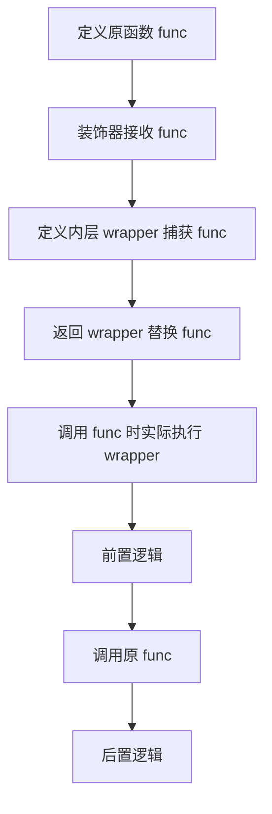

# 装饰器（Decorators）

> **🚀 核心目标**：读完这篇笔记，我能用自己的话把装饰器讲给一个完全不懂技术的朋友听，并且能随手写出核心代码。

---

## 🧠 第一部分：费曼入门（Feynman Introduction）

> **⚡ 黄金法则：禁止直接复制定义！必须用自己最通俗的语言重新组织。**

### 1.1 这是什么？（一句话说人话）

**用大白话定义**：
装饰器就像"给手机贴膜"——不改变手机内部零件，却给它加了防摔或防窥的新功能。在 Python 里，装饰器就是"给函数加功能"的函数：不改原函数代码，就能在它被调用之前/之后做额外的事（打印日志、计时、鉴权、缓存）。

### 1.2 生活类比（Analogy）

**用一个生活场景帮助记忆**：
想象你去餐厅点了一份原味蛋糕。服务员在端出来之前帮你"装饰"了一下：加了奶油、水果和蜡烛。蛋糕本身没变，但端上桌的效果丰富多了。装饰器就是那个"服务员"——在函数（蛋糕）执行前后，帮你加上日志、计时等"装饰"。

### 1.3 为什么我要学它？（解决什么痛点）

- **没有它**：要在 10 个函数里重复写日志/计时代码，改一处要改 10 处，容易漏。
- **有了它**：把"横切关注点"（日志、计时、鉴权）抽到装饰器里，一行 `@timer` 搞定，代码 DRY。
- **面试**："装饰器的实现原理是什么？" 是 Python 高频面试题，本质是闭包 + 函数一等公民。

---

## 🔬 第二部分：技术深度拆解（Deep Dive）

> **注意**：在写这部分之前，先问自己"我刚才的类比在技术细节上是否准确？"，查漏补缺。

### 2.1 核心机制（原理 / 数学 / 流程图）

**文字描述**：
装饰器的本质是一个**接收函数、返回函数**的高阶函数。语法糖 `@decorator` 等价于 `func = decorator(func)`。当装饰器返回内层 `wrapper` 函数时，`wrapper` 通过**闭包**捕获外层作用域里的 `func` 与参数，从而可以在调用原函数前后插入逻辑。

**流程图（Mermaid）**：


**核心公式（如有）**：
装饰器没有数学公式，但有一个"身份等式"值得记住：

$$
\text{decorated} = \text{decorator}(\text{original}), \qquad \text{decorated}(x) = \text{original}(x) + \text{额外行为}
$$

### 2.2 关键代码片段（核心逻辑）

```python
from collections.abc import Callable
from typing import TypeVar

F = TypeVar("F", bound=Callable[..., object])

def my_decorator(func: F) -> F:
    def wrapper(*args: object, **kwargs: object) -> object:
        print("调用前")                          # 前置逻辑
        result = func(*args, **kwargs)
        print("调用后")                          # 后置逻辑
        return result
    return wrapper  # type: ignore[return-value]
```

> **类型注解要点**：`TypeVar("F", bound=Callable)` 让装饰器尽量保留原函数签名；严格保留类型需用 `ParamSpec`（见第三部分）。

---

## 💻 第三部分：纸上得来终觉浅（Runable Code）

> **费曼强制输出**：此处的代码是手写（或完全理解后重打）的，带详细注释，像在教别人写代码一样。

### 3.1 完整可运行示例：日志 + 计时

```python
"""装饰器完整示例：计时 + 保留元信息，可直接运行。"""
import functools
import time
from collections.abc import Callable
from typing import ParamSpec, TypeVar

P = ParamSpec("P")   # 捕获原函数参数类型
R = TypeVar("R")     # 捕获原函数返回类型

def timer(func: Callable[P, R]) -> Callable[P, R]:
    """计时装饰器：打印函数执行耗时（毫秒）。"""
    @functools.wraps(func)   # 关键：保留原函数 __name__ / __doc__
    def wrapper(*args: P.args, **kwargs: P.kwargs) -> R:
        start = time.perf_counter()
        result = func(*args, **kwargs)
        elapsed = (time.perf_counter() - start) * 1000
        print(f"[timer] {func.__name__} 耗时 {elapsed:.2f} ms")
        return result
    return wrapper

@timer
def slow_add(a: int, b: int) -> int:
    """模拟慢操作：返回两数之和。"""
    time.sleep(0.1)
    return a + b

if __name__ == "__main__":
    print("结果:", slow_add(1, 2))
    print("函数名保留:", slow_add.__name__)
```

**运行输出**：
```
[timer] slow_add 耗时 100.02 ms
结果: 3
函数名保留: slow_add
```

### 3.2 带参数的装饰器（工厂模式）

```python
"""装饰器工厂：@repeat(times=3) 让函数重复执行。"""
from collections.abc import Callable
from typing import ParamSpec, TypeVar

P = ParamSpec("P")
R = TypeVar("R")

def repeat(times: int) -> Callable[[Callable[P, R]], Callable[P, R]]:
    """最外层是工厂：先接收参数 times，返回真正的装饰器。"""
    def decorator(func: Callable[P, R]) -> Callable[P, R]:
        def wrapper(*args: P.args, **kwargs: P.kwargs) -> R:
            result = func(*args, **kwargs)
            for _ in range(times - 1):
                result = func(*args, **kwargs)
            return result
        return wrapper
    return decorator

@repeat(times=3)
def say(word: str) -> str:
    print(f"说: {word}")
    return word

if __name__ == "__main__":
    say("你好")
```

**运行输出**：
```
说: 你好
说: 你好
说: 你好
```

> **层级记忆**：`@repeat(times=3)` 的执行顺序是 `repeat(times=3)` 先求值返回 `decorator`，再由 `decorator(say)` 完成装饰——**三层嵌套：工厂 → 装饰器 → wrapper**。

---

## ⚖️ 第四部分：权衡与面试视角（Trade-offs）

> 必须包含对比表格，这是面试高频区。

| 对比维度 | 装饰器 | 继承/子类重写 | 上下文管理器 |
| :--- | :--- | :--- | :--- |
| **优点** | 零侵入、组合灵活、横切逻辑复用 | 显式、类型安全、可覆写 | 天然配对 enter/exit，适合资源管理 |
| **缺点** | 隐式魔法、调试栈变深、滥用难读 | 需改类结构、继承层级膨胀 | 只适合"包裹一段代码" |
| **适用场景** | 日志、计时、缓存、鉴权 | 模板方法、多态扩展 | 文件/锁/事务生命周期 |

**📌 面试官追问**：不加 `@functools.wraps` 会怎样？
→ `wrapper.__name__` 会变成 `"wrapper"`，破坏内省（`help()`、日志、Sphinx 文档均受影响）。所以**内层函数一律加 `@functools.wraps(func)`**。

---

## 🔗 第五部分：关联知识 & 踩坑回忆

> **费曼连接**：这个知识点让我想起了之前学过的什么？搞砸过什么？

### 5.1 常见踩坑（Pitfalls）

- **坑点 1**：装饰器忘了加 `@functools.wraps`。
  - **原因**：`wrapper` 覆盖原函数元信息，`help()` 与日志看不到原函数名。
  - **解决**：内层函数统一加 `@functools.wraps(func)`。
- **坑点 2**：带参装饰器层级写错（多包/少包一层）。
  - **原因**：`@repeat(times=3)` 先执行工厂函数，返回真正的装饰器再装饰。
  - **解决**：牢记三层嵌套结构；写完后打印 `say.__name__` 自检。
- **坑点 3**：装饰器在**导入时**执行，而非调用时。
  - **原因**：`@decorator` 在模块加载阶段就运行。
  - **解决**：昂贵逻辑放 wrapper 内延迟执行；装饰器本体只做轻量组装。

### 5.2 关联笔记

- 依赖前置知识：[[闭包与作用域]]（01-Python/Language-Features，规划中）
- 进阶方向：[[生成器与迭代器]]（01-Python/Language-Features，规划中）
- 相关踩坑记录：[[10-Debug-Log/index.md]]

---

## 🗣️ 第六部分：费曼闭环——讲给小白听（强制输出）

> **🎯 真正的掌握，是能把厚书读薄。**

### 6.1 终极一句话（Twelve-Word Summary）

**用 12 个字以内总结本文核心**：
不改内部，调用前后加功能。

### 6.2 向 8 岁小孩解释

想象你在玩积木，你想要一个会发光的房子，但你不想把原来的房子拆了重盖，只需要在房子外面贴一层会发光的膜就行了。这层膜就是装饰器。Python 里的函数就像那座房子，装饰器就像那层膜——不用改函数里面的代码，就能在它"开工前"和"收工后"自动做事情，比如记时间、写日记。

### 6.3 如果我忘了，我只要记住……

**`func = decorator(func)`，一层贴膜，外层套内层。**

---

## 📚 参考与扩展（Bibliography）

- [Python 官方文档：术语表 - decorator](https://docs.python.org/3/glossary.html#term-decorator)
- [PEP 318 – Decorators for Functions and Methods](https://peps.python.org/pep-0318/)
- [Real Python – Primer on Python Decorators](https://realpython.com/primer-on-python-decorators/)

---

> **📝 审核记录**：本文借助 AI 工具生成，经人工审核。
> **最后更新**：2026-08-12
