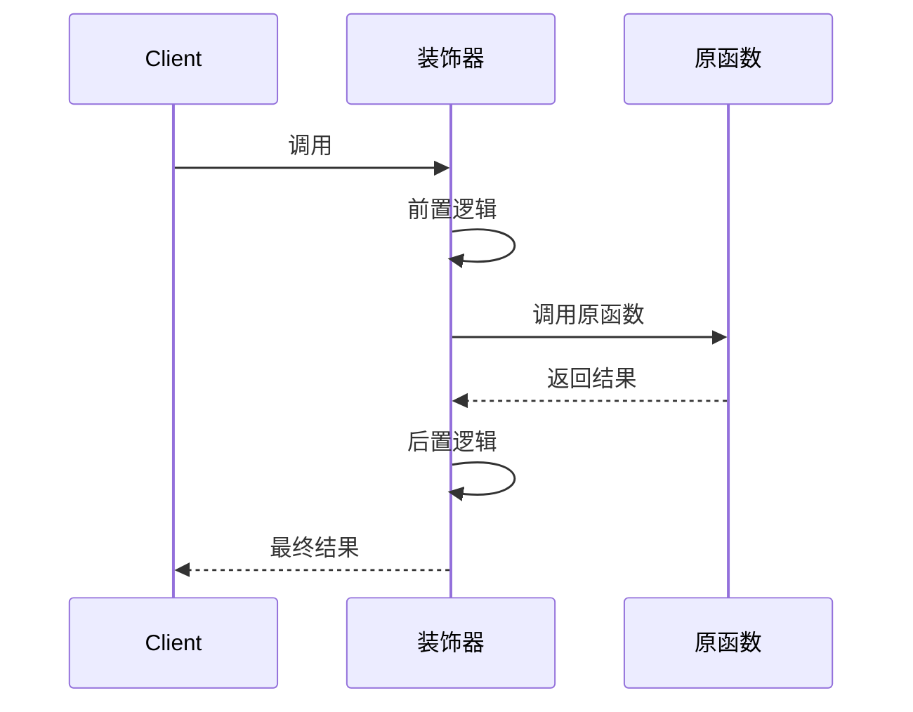

# [笔记标题]

> **🎯 核心目标**：读完后，能**无辅助**画出原理图，指出最容易出错的地方，并在真实场景中主动想起用它。


## 1. 认知构架（直觉建模 + 第一性原理）

> **法则**：先用直觉建立心理钩子，再用第一性原理剥离表象，直击本质。

### 1.1 一句话直觉 + 心智图（Feynman + Dual Coding）
- **一句话直觉 (Mental Model)**：
  （示例：装饰器就像给手机"换壳"，手机本身没变，但壳给了它新能力。）

- **视觉化心智图 (双重编码)**：
  【大脑同时处理图像与文字，记忆效果翻倍】
  ```mermaid
  graph LR
      A[原始对象] -->|动作| B(类比形象)
      B --> C[核心功能]
      C -->|结果| D[增强后的对象]
      style B fill:#f9f,stroke:#333,stroke-width:2px
  ```

- **痛点与反直觉 (逆向思维)**：
  - **解决痛点**：
  - **⚠️ 反直觉警告**：（初学者最易误解之处，如：以为装饰器会修改原函数源码）

### 1.2 核心本质（第一性原理）
- **基本真理**：（如：Python装饰器本质是"闭包" + "函数作为参数"）
- **输入 → 处理 → 输出**：
  - **输入**：
  - **处理**：
  - **输出**：

### 1.3 逻辑流（Mermaid 序列图）
> 仅展示决定性分支，去掉细枝末节。


---

## 2. 实践验证（刻意练习 + 排雷）

> **转变**：从"看懂"到"通过构造、破坏、对比来验证理解"。

### 2.1 最小可行性案例（手写验证）
> **强制输出**：不依赖文档，手写最简实现。
```python
def deliberate_practice() -> None:
    """包含：1.核心逻辑验证 2.打印调试观察"""
    pass
```

### 2.2 破坏性测试（苏格拉底式提问）
- **实验1**：（如：去掉 `*args, **kwargs` 会怎样？）
- **实验2**：（如：装饰器里返回 None 会怎样？）

### 2.3 变体对比表（揪出本质）
> **核心逻辑**：通过对比相似变体的不同结果，把"本质规律"从"偶然细节"中剥离出来。
| 变体 | 关键改动 | 运行结果 | 根因分析（链接到1.2本质） |
| :--- | :--- | :--- | :--- |
| **标准版** | （核心实现） | ✅ 正常工作 | |
| **变体A** | （改动点） | ❌ 报错/异常 | 因为违背了 [1.2中的某条基本原理] |
| **变体B** | （改动点） | ⚠️ 输出不同 | 因为触发了 [边界条件] |

### 2.4 排雷手册（常见错误与修复）
- **❌ 错误现象**：（如：`TypeError: 'NoneType' object is not callable`）
- **🔍 根本原因**：（用第一性原理链接到1.2解释）
- **✅ 解决方案**：（代码或操作步骤）

> 💡 踩过的坑请同步登记到 [10-Debug-Log 踩坑记录板块](10-Debug-Log/index.md)。

---

## 3. 全景视角（选型 + 知识网络）

> **对比与关联**：明确"何时用它、何时不用"，并通过链接挂住旧知识、延伸新知识。

### 3.1 方案选型矩阵
| 对比维度 | **方案 A (本文)** | 方案 B | 方案 C |
| :--- | :--- | :--- | :--- |
| **核心思想** | (一句话) | | |
| **性能** | 🟢/🟡/🔴 | | |
| **复杂度** | 🟢/🔴 | | |
| **最佳击球点** | (适用场景) | | |

### 3.2 边界条件
- **擅长**：
- **绝对不擅长**：

### 3.3 关联知识网
- **前置依赖**：[打包与依赖](../Packaging/xxx.md)（必先懂什么？）
- **横向关联**：[相关技术笔记](xxx.md)（异同对比？）
- **进阶方向**：[并发编程](../Concurrency/xxx.md)（下一步学什么？）

---

## 4. 费曼闭环 + 记忆提取

> **真正的掌握，是能随时从大脑中"提取"知识，而非仅"识别"知识。**

- **12字终极极简**：
  （示例：闭包传参，不改原函，增强功能。）

- **给5岁孩子的解释（费曼技巧，禁止黑话）**：
  （示例：装饰器就像给玩具车装遥控器，不用拆车，贴上去就能遥控。）

- **Anki 闪光点（间隔重复素材）**：
  - **Q1**：(核心细节) → **A1**：
  - **Q2**：(面试高频) → **A2**：
  - **Q3**：(易错点) → **A3**：

- **倒推复原（从答案反推问题）**：
  > 模拟场景：你只拿到一段报错或一段代码输出，能反推出完整的问题全貌吗？
  - **给定线索**：（放一段报错信息或奇怪输出，例如：`TypeError: 'NoneType' object is not callable`）
  - **我的复原**：
    - 问题场景是：
    - 触发条件：
    - 根本原因（链接到1.2本质）：

---

## 5. 执行意图（触发条件 → 行动）

> **心理学 If-Then Planning**：预设"场景→行动"映射，让你在真实项目中能自动化调用此知识。

- **If** 我遇到 [具体业务场景/代码报错特征]，**then** 我会立即使用 [本笔记中的核心技术] 来解决。
- **If** 我准备写出 [某种常见反模式/危险代码]，**then** 我会先停下来，对照 [1.2 核心本质] 检查是否违背了基本原则。

---

## 📚 参考与扩展
- [官方文档](链接)
- [优质源码/深度解析](链接)

---
**📝 审核**：本文 [是/否] 借助 AI 工具生成，经人工审核。
**📅 最后更新**：YYYY-MM-DD
