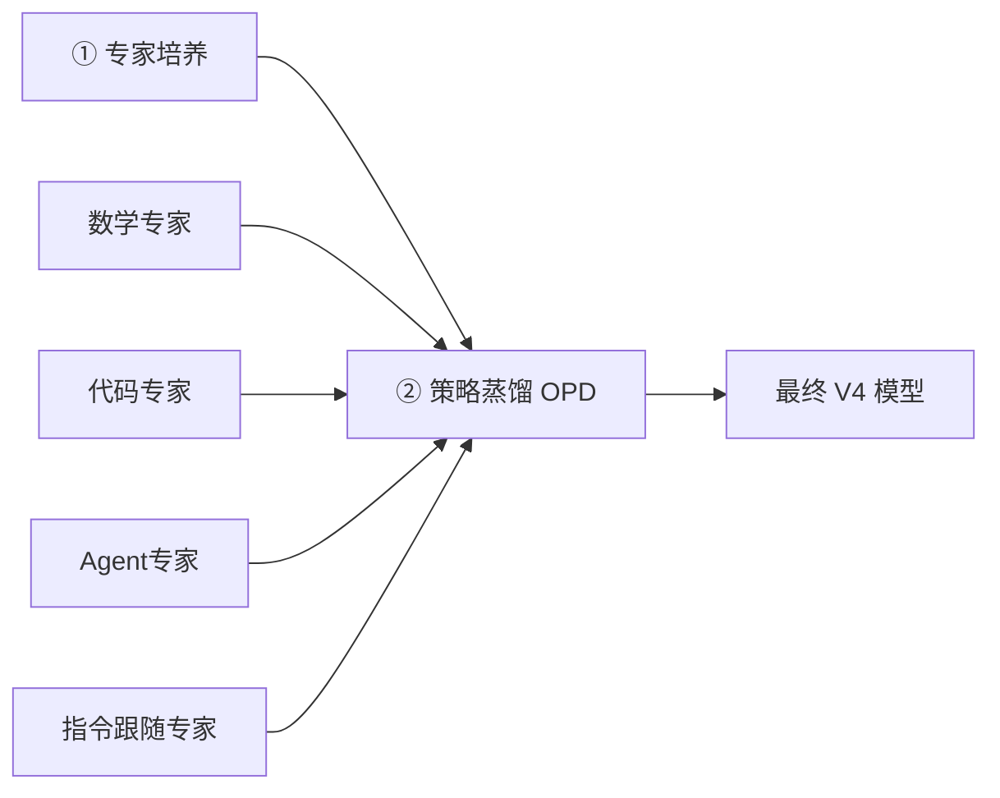

## 一、模型概述

### 1.1 基本信息

| 项目 | 内容 |
|------|------|
| **模型名称** | DeepSeek-V4 |
| **发布机构** | 深度求索 (DeepSeek) |
| **发布时间** | 预览版：2026.04.24｜正式版：2026.08.13 |
| **开源状态** | ✅ 已开源，登顶 Hugging Face 开源模型榜 |
| **技术报告** | 58页，公开可阅 |
| **核心标签** | 全球首个将百万上下文作为默认能力的开源MoE模型 |

### 1.2 版本对比

| 维度 | V4-Pro | V4-Flash |
|------|--------|----------|
| **总参数量** | 1.6 万亿 | 2840 亿 |
| **激活参数量** | 490 亿 | 130 亿 |
| **上下文长度** | 1M tokens ✅ | 1M tokens ✅ |
| **定位** | 旗舰级，追求极致性能 | 高效版，追求性价比 |
| **适用场景** | 复杂推理、代码生成、长文档理解 | 日常对话、快速响应、成本敏感场景 |

> 💡 **一句话理解**：13B激活的Flash在多数指标上已超越37B激活的V3.2，架构创新带来的效率提升远大于参数堆砌。


## 二、核心技术解析

### 2.1 硬件适配与基础设施

| 技术点 | 具体内容 |
|--------|----------|
| **国产化适配** | 完整适配华为昇腾NPU，覆盖训练到推理全链路 |
| **专家并行 (EP)** | 自研MegaMoE方案，通信与计算重叠，GPU/NPU上实现 **1.50-1.73倍**加速，CUDA已开源 |
| **精度策略** | 采用 **FP4 + FP8 混合精度**（MoE专家权重用FP4，其余用FP8） |
| **Kernel优化** | TileLang融合内核，调用开销从百微秒压至 **<1微秒**；Z3求解器实现**比特级可复现** |

### 2.2 模型架构创新

#### ① 混合注意力机制（Hybrid Attention）—— 最核心的架构突破

| 注意力类型 | 压缩率 | 功能 |
|------------|--------|------|
| **CSA**（压缩稀疏注意力） | 4:1 | 每4个token合并为1个压缩条目，精准细节定位 |
| **HCA**（重度压缩注意力） | 128:1 | 全局语义捕捉，把握整体脉络 |

> 📊 **效果**：1M上下文下，V4-Pro推理计算量仅为V3.2的 **27%**，KV缓存占用仅 **10%**。

#### ② Manifold-Constrained Hyper-Connections (mHC)

- **本质**：将残差映射矩阵约束在"双随机矩阵"流形上
- **作用**：从数学上保证信号在超深网络中稳定传播，不放大也不抵消

#### ③ Muon优化器

- **做法**：抛弃业界标配的AdamW，改用Muon
- **原理**：对梯度矩阵做近似正交化（Newton-Schulz迭代），使奇异值趋近于1
- **优势**：收敛更快、训练更稳，考虑参数矩阵整体结构来决定更新方向

### 2.3 训练方法论

#### 预训练数据

| 版本 | 数据规模 | 重点语料类型 |
|------|----------|-------------|
| V4-Pro | **33T** tokens | 数学、代码、Agent交互、长文档 |
| V4-Flash | **32T** tokens | 同左（数据规模略有缩减） |

> 🔧 **关键技巧**：引入**样本级注意力掩码**，解决多段文本拼接训练带来的语义不连续问题。

#### 后训练新范式：专家培养 + 策略蒸馏 (OPD)

V4彻底摒弃了预览版用的混合强化学习（混合RL）方法，取而代之的是一套两阶段新范式：



**阶段一：专家培养**
- 针对数学、代码、Agent、指令跟随等**4个领域**分别训练独立的"专家"模型
- 每个专家独立进行 **SFT + GRPO** 强化学习

**阶段二：On-Policy Distillation（OPD）**
- 让一个"学生"模型在自己采样的轨迹上，同时蒸馏所有专家的logits
- 使用**全词表logits蒸馏**（反向KL散度），虽然计算开销大但梯度方差小
- 工程方案：教师权重按需加载、只缓存最后一层hidden state、用TileLang专门写KL散度kernel

> ✅ **优势**：避免多目标RL的"能力互蚀"问题，训练更稳定可控。

### 2.4 训练稳定性保障

| 技术 | 原理 | 效果 |
|------|------|------|
| **Anticipatory Routing（预判路由）** | 训练异常时用旧参数计算路由决策，避免路由震荡 | 防止训练崩溃 |
| **SwiGLU Clamping** | 将SwiGLU输出clip到 [-10, 10]，抹掉激活值中的outlier | 抹掉异常值 |

> 🎯 **合效**：两项技术并用后，V4系列整个训练过程**再未发生过崩溃**。


## 三、推理与使用指南

### 3.1 推理模式（思考预算）

V4提供三档可调节的思考强度，通过 `reasoning_effort` 参数控制：

| 模式 | 适用场景 | 说明 |
|------|----------|------|
| **low** | 日常简单对话 | 响应最快、成本最低 |
| **high** | 数学、编程、复杂逻辑 | 投入更多算力深度推理 |
| **max** | 最复杂的推理任务 | 使用专门system prompt引导最长深度思考 |

> ⚠️ **使用注意**：工具调用（Tool Call）场景下，thinking trace跨用户消息保留（利用1M上下文），但普通对话会清空，避免上下文膨胀。

### 3.2 API调用方式

DeepSeek V4 API **完全兼容 OpenAI SDK**，只需修改 `base_url` 和 `api_key`：

```python
from openai import OpenAI

client = OpenAI(
    api_key="your-deepseek-api-key",
    base_url="https://api.deepseek.com/v1"
)

response = client.chat.completions.create(
    model="deepseek-v4-pro",  # 或 deepseek-v4-flash
    messages=[{"role": "user", "content": "..."}],
    temperature=0.7,
    max_tokens=4096,           # ⚠️ 注意是 max_tokens，不是 max_completion_tokens
)
```

**关键参数速查**：

| 注意点 | 说明 |
|--------|------|
| `max_tokens` | ✅ 输出限制字段（非 `max_completion_tokens`） |
| System角色 | ✅ 支持（不支持 `developer` 角色） |
| 思考模式+Tool Call | ⚠️ 不支持同时使用 `tool_choice` 参数 |

### 3.3 Function Calling / 工具调用

V4原生支持工具调用，可直接集成Agent工作流：

```python
response = client.chat.completions.create(
    model="deepseek-v4-pro",
    messages=[{"role": "user", "content": "北京今天天气怎么样？"}],
    tools=[{
        "type": "function",
        "function": {
            "name": "get_weather",
            "parameters": {
                "type": "object",
                "properties": {"city": {"type": "string"}},
                "required": ["city"]
            }
        }
    }],
    tool_choice="auto"
)
```

**Thinking模式下的集成配置**（以Oh My Pi为例）：
- `supportsToolChoice: false` — 思考模式下不接受 tool_choice
- `requiresReasoningContentForToolCalls: true` — 要求tool call对话历史中保留推理内容
- `requiresAssistantContentForToolCalls: true` — 确保assistant消息content不为空

### 3.4 上下文缓存（Context Caching）

- **机制**：系统提示词和工具定义反复输入时自动缓存
- **效果**：复用已有KV cache，大幅降低重复输入成本
- **架构优势**：得益于混合注意力优化，KV cache仅占V3.2的10%

### 3.5 Quick Instruction 特性

- **功能**：将触发搜索、意图识别、标题生成等辅助任务用特殊token拼到输入末尾
- **优势**：复用已有KV cache、并行执行，无需挂载小模型

### 3.6 部署配置示例


**Oh My Pi 配置** `~/.omp/agent/models.yml`：

```yaml
providers:
  deepseek:
    baseUrl: https://api.deepseek.com
    apiKey: DEEPSEEK_API_KEY
    models:
      - id: deepseek-v4-pro
        contextWindow: 1000000
        maxTokens: 384000
        thinking:
          minLevel: high
          maxLevel: xhigh
          mode: effort
        reasoningEffortMap:
          high: high
          xhigh: max
```


## 四、定价与成本（正式版 API，2026.08.17起生效）

V4采用**峰谷定价**模式：

| 计费项 | 预览版价格 | 正式版高峰价 | 正式版空闲价 | 涨幅（空闲） |
|--------|-----------|-------------|-------------|-------------|
| **输入（缓存命中）** | 0.025元/MT | 0.30元/MT | **0.15元/MT** | ⬆ 500% |
| **输入（缓存未命中）** | 3元/MT | 9元/MT | **4.5元/MT** | ⬆ 50% |
| **输出** | 6元/MT | 27元/MT | **13.5元/MT** | ⬆ 125% |

> 📌 1 MT = 1 Million Tokens（百万tokens）
> 📌 高峰/空闲时段划分及具体时间请以官方公告为准

> ⚠️ **Flash版本定价更低**，具体请查阅API文档。V4-Pro预览版的低定价已不复存在。


## 五、性能与评估

### 5.1 基准测试表现

**Base模型对比（不含推理增强）**：

| Benchmark | V3.2-Base (37B激活) | V4-Flash-Base (13B激活) | V4-Pro-Base (49B激活) |
|-----------|:---:|:---:|:---:|
| MMLU (5-shot) | 87.8 | 88.7 | **90.1** |
| MMLU-Pro (5-shot) | 65.5 | 68.3 | **73.5** |
| AGIEval (0-shot) | 80.1 | 82.6 | **83.1** |
| C-Eval (5-shot) | 90.4 | 92.1 | **93.1** |

**V4-Pro正式版高光表现**：

| 能力域 | 成绩 | 亮点说明 |
|--------|------|----------|
| 🏆 **编程** | Codeforces 3206 | 人类排名第23，与GPT-5.4打平，首次开源模型达此高度 |
| 🏆 **数学** | PutnamBench 120/120 | 满分，与Axiom持平 |
| 🏆 **数学** | HMMT 2026 95.2 / IMOAnswerBench 89.8 | 已触及第一梯队 |
| 🏆 **长上下文** | 1M MRCR @ 1024K 0.59 MMR | 全程稳定，不随长度衰减 |
| 🏆 **Agent (正式版)** | DeepSWE 62.7, Cybergym 83.3 | 分别较预览版提升 **390%** 和 58% |
| 🏆 **中文写作** | 对Gemini-3.1-Pro胜率62.7% | 胜因：Gemini常覆盖用户风格要求 |

### 5.2 NIST/CAISI 第三方评估（2026.05）

美国国家标准与技术研究院下属CAISI对V4-Pro的评估结论：

| 评估项 | 结论 |
|--------|------|
| **综合定位** | CAISI评估过的最强大的中国AI模型 |
| **能力差距** | 约落后美国前沿模型 **8个月**（相当于GPT-5水平）* |
| **成本效益** | 与GPT-5.4 mini比，7项基准中5项更具成本效益，成本低53%~高41% |

> \* 多家媒体对该评估方法提出质疑，建议批判性看待。

**CAISI评测具体分数**：

| Benchmark | GPT-5.5 (xhigh) | Opus 4.6 (max) | V4-Pro-Max |
|-----------|:---:|:---:|:---:|
| SWE-Bench Verified | 81% | 79% | **74%** |
| GPQA-Diamond | 96% | 91% | **90%** |
| OTIS-AIME-2025 | 100% | 92% | **97%** |

### 5.3 能力边界总结

| ✅ 强项 | ⚠️ 短板 |
|---------|----------|
| 长文档理解与处理（1M上下文） | 部分知识类任务距GPT-5.5/Gemini-3.1-Pro仍有差距 |
| 编程竞赛与代码生成 | 最复杂Agent任务（如SWE-Bench）仍处第二梯队 |
| 数学推理（已在第一梯队） | 正式版定价大幅上升，性价比优势减弱 |
| 中文写作（指令遵循与质量） | Flash版本纯知识任务略逊于Pro |
| Agent任务（正式版大幅提升） | — |


## 六、版本追踪

| 日期 | 版本 | 关键更新 |
|------|------|----------|
| 2026.04.24 | V4-Pro Preview / V4-Flash Preview | 首次发布，开源模型权重及58页技术报告 |
| 2026.07.31 | V4-Flash 正式版 | API公测，Agent能力大幅增强，模型结构不变 |
| **2026.08.13** | **V4-Pro 正式版 (0813)** | 🚀 **Agent能力质变**：DeepSWE 12.8→62.7，Cybergym 52.7→83.3；推理模式三档细化；API全面切换新版 |


## 七、个人实测备忘

> 📝 *建议在此记录自己使用V4的实际体验、成功Prompt案例、踩坑点等*


## 📎 参考资料来源

1. DeepSeek-V4 技术报告 — https://huggingface.co/deepseek-ai/DeepSeek-V4-Pro/blob/main/DeepSeek_V4.pdf
2. Hugging Face 模型页 — https://huggingface.co/collections/deepseek-ai/deepseek-v4
3. CAISI 评估报告 — https://www.nist.gov/news-events/news/2026/05/caisi-evaluation-deepseek-v4-pro
4. DeepSeek 官方API文档
5. 社区资讯及官方公告（2026.08.13正式版发布信息）