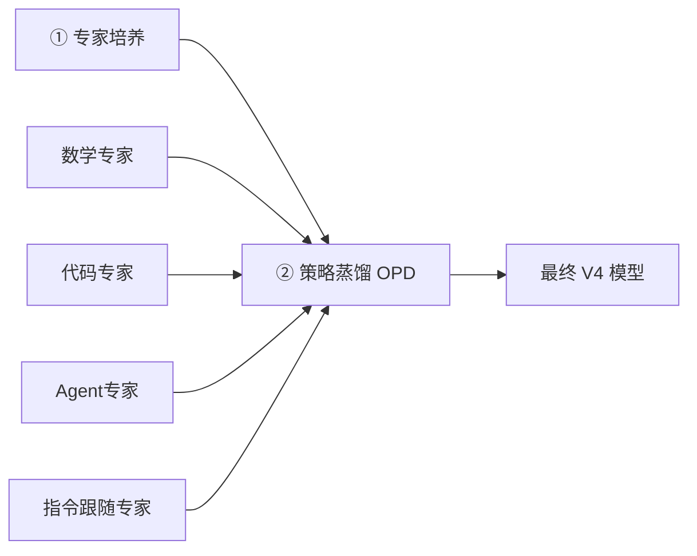

# DeepSeek-V4 模型

## 定义

DeepSeek-V4 是深度求索（DeepSeek）于 2026 年发布的开源混合专家（MoE）大语言模型，是全球首个把百万级上下文（1M tokens）作为**默认能力**的开源 MoE 模型。预览版于 2026.04.24 发布，V4-Pro 正式版于 2026.08.13 发布，模型权重与 58 页技术报告均已开源，并登顶 Hugging Face 开源模型榜。

它要解决的问题有三类：① 超长上下文下 Attention 计算量与 KV 缓存爆炸（直接把窗口扩到 1M 不可行）；② 后训练阶段多目标 RL 导致的"能力互蚀"（数学/代码/Agent 等能力互相干扰）；③ 开源模型在编程、数学、Agent 等硬任务上与闭源前沿模型的差距。

核心特征不是单纯堆参数，而是**架构（Hybrid Attention、mHC）、优化器（Muon）、训练范式（专家培养 + 策略蒸馏 OPD）、推理/定价（思考预算、峰谷定价）**的全栈重构。适用范畴：长文档理解、复杂推理、代码生成、Agent 工作流、中文写作等，同时提供旗舰与高效两条产品线供性能/成本取舍。

**版本对比**：

| 维度 | V4-Pro | V4-Flash |
|------|--------|----------|
| **总参数量** | 1.6 万亿 | 2840 亿 |
| **激活参数量** | 490 亿 | 130 亿 |
| **上下文长度** | 1M tokens ✅ | 1M tokens ✅ |
| **定位** | 旗舰级，追求极致性能 | 高效版，追求性价比 |
| **适用场景** | 复杂推理、代码生成、长文档理解 | 日常对话、快速响应、成本敏感场景 |

> 13B 激活的 Flash 在多数指标上已超越 37B 激活的 V3.2，架构创新带来的效率提升远大于参数堆砌。

**版本追踪**：

| 日期 | 版本 | 关键更新 |
|------|------|----------|
| 2026.04.24 | V4-Pro Preview / V4-Flash Preview | 首次发布，开源模型权重及 58 页技术报告 |
| 2026.07.31 | V4-Flash 正式版 | API 公测，Agent 能力大幅增强，模型结构不变 |
| **2026.08.13** | **V4-Pro 正式版 (0813)** | 🚀 **Agent 能力质变**：DeepSWE 12.8→62.7，Cybergym 52.7→83.3；推理模式三档细化；API 全面切换新版 |

**能力边界**：

| ✅ 强项 | ⚠️ 短板 |
|---------|----------|
| 长文档理解与处理（1M 上下文） | 部分知识类任务距 GPT-5.5/Gemini-3.1-Pro 仍有差距 |
| 编程竞赛与代码生成 | 最复杂 Agent 任务（如 SWE-Bench）仍处第二梯队 |
| 数学推理（已在第一梯队） | 正式版定价大幅上升，性价比优势减弱 |
| 中文写作（指令遵循与质量） | Flash 版本纯知识任务略逊于 Pro |
| Agent 任务（正式版大幅提升） | — |

## 原理

**① 混合注意力机制（Hybrid Attention）—— 最核心的架构突破**。Attention 的计算与 KV 随序列长度近似平方/线性膨胀，直接用满 1M 窗口代价极高。V4 把 token 按两级粒度压缩后再参与注意力，形成"稀疏保细节 + 重度压缩保全局"的双通道：**CSA**（压缩稀疏注意力，4:1）每 4 个 token 合并为 1 个压缩条目，用于精准细节定位；**HCA**（重度压缩注意力，128:1）负责全局语义捕捉、把握整体脉络。

| 注意力类型 | 压缩率 | 功能 |
|------------|--------|------|
| **CSA**（压缩稀疏注意力） | 4:1 | 每 4 个 token 合并为 1 个压缩条目，精准细节定位 |
| **HCA**（重度压缩注意力） | 128:1 | 全局语义捕捉，把握整体脉络 |

> 📊 **效果**：1M 上下文下，V4-Pro 推理计算量仅为 V3.2 的 **27%**，KV 缓存占用仅 **10%**——这也是 1M 上下文能成为"默认能力"的数学基础，并顺带让上下文缓存成本大幅下降。

**② Manifold-Constrained Hyper-Connections (mHC)**：把超深网络里的残差映射矩阵约束在"双随机矩阵"流形上，从数学上保证信号在超深网络中稳定传播——既不放大也不抵消，解决了超深网络梯度/信号退化问题，替代了传统的 LayerScale/残差缩放等经验手段。

**③ Muon 优化器（替代 AdamW）**：不再按元素独立更新参数，而是对梯度矩阵做**近似正交化**（Newton-Schulz 迭代），使梯度矩阵奇异值趋近于 1，再考虑参数矩阵的**整体结构**来决定更新方向。收益是收敛更快、训练更稳，属于"把矩阵当成矩阵来优化"的结构化优化思路。

**④ 硬件适配与精度策略（MegaMoE / FP4+FP8 / TileLang）**：完整适配华为昇腾 NPU（训练到推理全链路）；自研 MegaMoE 专家并行（EP）方案让通信与计算重叠，在 GPU/NPU 上实现 **1.50–1.73 倍**加速，CUDA 实现已开源；MoE 专家权重用 **FP4**、其余用 **FP8** 的混合精度；TileLang 融合内核把 kernel 调用开销从百微秒压至 **<1 微秒**；用 Z3 求解器实现**比特级可复现**（同输入同硬件的训练/推理结果逐比特一致）。

**⑤ 预训练方法论**：V4-Pro 用 **33T** tokens、V4-Flash 用 **32T** tokens（重点语料：数学、代码、Agent 交互、长文档）。关键技巧是引入**样本级注意力掩码**（sample-level attention mask），解决多段文本拼接训练带来的语义不连续问题——让注意力只落在同一样本内部，避免跨样本"串味"。

**⑥ 后训练新范式：专家培养 + 策略蒸馏（OPD）**。V4 彻底摒弃预览版的混合强化学习（混合 RL），改为两阶段：



- **阶段一：专家培养**——针对数学、代码、Agent、指令跟随 4 个领域分别训练独立的"专家"模型，每个专家独立做 **SFT + GRPO** 强化学习。领域隔离使每个专家可被优化到极致，互不干扰。
- **阶段二：On-Policy Distillation（OPD）**——让一个"学生"模型在**自己采样**的轨迹上，同时蒸馏所有专家的 logits；采用**全词表 logits 蒸馏（反向 KL 散度）**，计算开销大但梯度方差小。工程落地：教师权重按需加载、只缓存最后一层 hidden state、用 TileLang 专门编写 KL 散度 kernel。
- **为什么这样设计**：多目标 RL 往往引发"能力互蚀"（一个领域涨、另一个领域跌），且联合训练不稳定难调；先隔离培养再统一蒸馏，训练更稳定可控，这也是 V4 各项能力能同时拉满的关键。

**⑦ 训练稳定性保障**：**Anticipatory Routing（预判路由）**——训练异常时用旧参数计算路由决策，避免路由震荡导致训练崩溃；**SwiGLU Clamping**——把 SwiGLU 输出 clip 到 [-10, 10]，抹掉激活值中的 outlier。两项技术并用后，V4 系列整个训练过程**再未发生过崩溃**。

## 应用

**推理模式（思考预算）**：V4 通过 `reasoning_effort` 参数提供三档可调节的思考强度，按任务复杂度选档以平衡质量与成本。

| 模式 | 适用场景 | 说明 |
|------|----------|------|
| **low** | 日常简单对话 | 响应最快、成本最低 |
| **high** | 数学、编程、复杂逻辑 | 投入更多算力深度推理 |
| **max** | 最复杂的推理任务 | 使用专门 system prompt 引导最长深度思考 |

> ⚠️ **Thinking 上下文行为**：工具调用（Tool Call）场景下，thinking trace 会**跨用户消息保留**（利用 1M 上下文）；普通对话则会清空，避免上下文膨胀。

**API 调用**：完全兼容 OpenAI SDK，只需改 `base_url` 与 `api_key`。关键参数坑速查：

| 注意点 | 说明 |
|--------|------|
| `max_tokens` | ✅ 输出限制字段（**非** `max_completion_tokens`） |
| System 角色 | ✅ 支持（**不支持** `developer` 角色） |
| 思考模式 + Tool Call | ⚠️ 不支持同时使用 `tool_choice` 参数 |

**Function Calling / 工具调用**：V4 原生支持工具调用，可直接集成 Agent 工作流。Thinking 模式下的 Agent 前端集成配置（以 Oh My Pi 为例）：`supportsToolChoice: false`（思考模式下不接受 tool_choice）；`requiresReasoningContentForToolCalls: true`（要求 tool call 对话历史中保留推理内容）；`requiresAssistantContentForToolCalls: true`（确保 assistant 消息 content 不为空）。

**上下文缓存（Context Caching）**：系统提示词与工具定义反复输入时自动缓存，复用已有 KV cache 以大幅降低重复输入成本；得益于混合注意力优化，KV cache 仅占 V3.2 的 10%，缓存收益被进一步放大。

**Quick Instruction 特性**：把触发搜索、意图识别、标题生成等辅助任务用特殊 token 拼到输入末尾，复用已有 KV cache、并行执行，无需挂载小模型。

**定价与成本（正式版 API，2026.08.17 起生效，峰谷定价）**：

| 计费项 | 预览版价格 | 正式版高峰价 | 正式版空闲价 | 涨幅（空闲） |
|--------|-----------|-------------|-------------|-------------|
| **输入（缓存命中）** | 0.025元/MT | 0.30元/MT | **0.15元/MT** | ⬆ 500% |
| **输入（缓存未命中）** | 3元/MT | 9元/MT | **4.5元/MT** | ⬆ 50% |
| **输出** | 6元/MT | 27元/MT | **13.5元/MT** | ⬆ 125% |

> 📌 1 MT = 1 Million Tokens（百万 tokens）；高峰/空闲时段划分以官方公告为准。
> ⚠️ **Flash 版本定价更低**（以 API 文档为准）；V4-Pro 预览版的低定价已不复存在——成本敏感场景优先 Flash，或把高频 system prompt/工具定义做进上下文缓存。

**性能评估参考（选型依据）**：Base 模型对比（不含推理增强）：

| Benchmark | V3.2-Base (37B激活) | V4-Flash-Base (13B激活) | V4-Pro-Base (49B激活) |
|-----------|:---:|:---:|:---:|
| MMLU (5-shot) | 87.8 | 88.7 | **90.1** |
| MMLU-Pro (5-shot) | 65.5 | 68.3 | **73.5** |
| AGIEval (0-shot) | 80.1 | 82.6 | **83.1** |
| C-Eval (5-shot) | 90.4 | 92.1 | **93.1** |

V4-Pro 正式版高光表现：**编程** Codeforces 3206（人类排名第 23，与 GPT-5.4 打平，首次开源模型达此高度）；**数学** PutnamBench 120/120（满分，与 Axiom 持平）、HMMT 2026 95.2 / IMOAnswerBench 89.8（第一梯队）；**长上下文** 1M MRCR @ 1024K 0.59 MMR（全程稳定不随长度衰减）；**Agent（正式版）** DeepSWE 62.7、Cybergym 83.3（较预览版提升 390% 与 58%）；**中文写作** 对 Gemini-3.1-Pro 胜率 62.7%（Gemini 常覆盖用户风格要求是其败因）。

NIST/CAISI 第三方评估（2026.05）：CAISI 评估过的**最强大的中国 AI 模型**；能力约落后美国前沿模型 **8 个月**（相当于 GPT-5 水平）*；与 GPT-5.4 mini 相比 7 项基准中 5 项更具成本效益（成本低 53% ~ 高 41%）。具体分数：SWE-Bench Verified 74%（GPT-5.5 81% / Opus 4.6 79%）、GPQA-Diamond 90%（96%/91%）、OTIS-AIME-2025 97%（100%/92%）。

> \* 多家媒体对该评估方法提出质疑，建议批判性看待。

**常见坑汇总**：
- 用 `max_completion_tokens` 而非 `max_tokens` → 输出限制不生效；SDK 兼容层只认 `max_tokens`。
- 传 `developer` 角色 → 报错/不生效；V4 只支持 `system`。
- 思考模式（thinking）下同时传 `tool_choice` → 不受支持；需要工具调用时要么关 thinking，要么把工具声明放进 system prompt 走自然语言触发。
- 推理档位一刀切 → 简单对话开 max 浪费成本；长 Agent 会话不清理 thinking trace 会占满上下文（普通对话会自动清空，勿依赖其保留推理内容）。
- 仍按预览版价格做成本预算 → 正式版缓存命中输入价上涨 500%，务必核对峰谷价与 Flash 定价。
- Agent 前端接入（如 Oh My Pi）不配置 `requiresReasoningContentForToolCalls` 等三项 → 工具调用轮次缺推理内容/空 content，导致历史拼接异常。
- 建议在此持续补充个人实测：成功 Prompt 案例、踩坑点与延迟/成本实测数据。

```python
# ============================================================
# 1) 基础对话：DeepSeek V4 API 完全兼容 OpenAI SDK
#    只改 base_url + api_key 即可，无需换库
# ============================================================
from openai import OpenAI

client = OpenAI(
    api_key="your-deepseek-api-key",
    base_url="https://api.deepseek.com/v1"   # 换成 DeepSeek 的 endpoint
)

response = client.chat.completions.create(
    model="deepseek-v4-pro",          # 或 deepseek-v4-flash（更便宜、更快）
    messages=[{"role": "user", "content": "..."}],
    temperature=0.7,
    max_tokens=4096,                  # ⚠️ 坑：必须是 max_tokens，不是 max_completion_tokens
)
print(response.choices[0].message.content)

# ============================================================
# 2) Function Calling / 工具调用（可集成 Agent 工作流）
# ============================================================
response = client.chat.completions.create(
    model="deepseek-v4-pro",
    messages=[{"role": "user", "content": "北京今天天气怎么样？"}],
    tools=[{
        "type": "function",
        "function": {
            "name": "get_weather",              # 工具名，模型会按需生成调用参数
            "parameters": {
                "type": "object",
                "properties": {"city": {"type": "string"}},
                "required": ["city"]
            }
        }
    }],
    tool_choice="auto"                # ⚠️ 坑：思考模式(thinking)下不支持 tool_choice 参数
)

# ============================================================
# 3) 部署/前端配置示例 —— Oh My Pi 的 ~/.omp/agent/models.yml
#    （reasoningEffortMap 把前端档位映射到 V4 的 reasoning_effort）
# ============================================================
# providers:
#   deepseek:
#     baseUrl: https://api.deepseek.com
#     apiKey: DEEPSEEK_API_KEY
#     models:
#       - id: deepseek-v4-pro
#         contextWindow: 1000000          # 1M 上下文是默认能力
#         maxTokens: 384000
#         thinking:
#           minLevel: high
#           maxLevel: xhigh
#           mode: effort
#         reasoningEffortMap:
#           high: high
#           xhigh: max
```

---
## 关联
- 前置：[[Transformer 注意力机制]]、[[MoE 混合专家模型]]、[[KV Cache 与长上下文推理]]
- 类似：[[DeepSeek-V3.2]]（区别是 V3.2 为 37B 激活、上下文较短，不具备混合注意力/mHC/Muon/OPD 等新架构，多数基准被 13B 激活的 V4-Flash 反超）
- 类似：[[DeepSeek-R1]]（区别是 R1 只做推理增强的后训练、架构沿用旧代，而 V4 从注意力架构、优化器到训练范式全栈重构）
- 类似：[[GPT-5.4 / GPT-5.5]]（区别是闭源前沿商业模型，V4 开源可自部署且中文写作/成本效益更优，但最复杂 Agent 任务与部分知识类任务仍落后约 8 个月）
- 进阶：[[Muon 优化器原理]]、[[知识蒸馏（反向 KL / OPD）]]、[[百万上下文推理优化]]

---
## 对比选型
| 方案 | 核心思想 | 最佳场景 |
|------|---------|----------|
| DeepSeek-V4-Pro（本文方案） | MoE(49B 激活) + 混合注意力 + mHC + Muon + OPD 蒸馏，1M 上下文默认，全开源 | 长文档、复杂推理/编程/数学、Agent、中文写作，可自部署的中文旗舰 |
| DeepSeek-V4-Flash | 同架构精简版（13B 激活），多数指标仍超 V3.2 | 日常对话、高并发、成本敏感场景（定价更低） |
| DeepSeek-V3.2 | 传统 MoE（37B 激活）+ 短上下文，无新架构与 OPD | 对上下文无 1M 需求、沿用旧 API/链路的存量任务 |
| GPT-5.x / Gemini-3.1-Pro（闭源前沿） | 闭源超大模型 + 专有后训练，SLA 托管 | 最复杂 Agent（SWE-Bench 级）与合规商用，但贵且不可自部署 |

**选型速查**：要极致性能+自部署选 V4-Pro，要性价比/低延迟选 V4-Flash，要旧链路兼容选 V3.2，要最复杂 Agent 与商业 SLA 才考虑闭源前沿。

---
## 参考
- [DeepSeek-V4 技术报告（58页 PDF，Hugging Face）](https://huggingface.co/deepseek-ai/DeepSeek-V4-Pro/blob/main/DeepSeek_V4.pdf)
- [Hugging Face 模型集合：deepseek-ai/deepseek-v4](https://huggingface.co/collections/deepseek-ai/deepseek-v4)
- [NIST CAISI 评估报告（2026.05，对 V4-Pro）](https://www.nist.gov/news-events/news/2026/05/caisi-evaluation-deepseek-v4-pro)
- [DeepSeek 官方 API 文档](https://api-docs.deepseek.com/)
- [DeepSeek 官网（2026.08.13 正式版发布公告等最新消息）](https://www.deepseek.com/)

---
## 具体案例
- [[DeepSeek-V4 模型 实战示例]](DeepSeek-V4 模型_sample.py)
