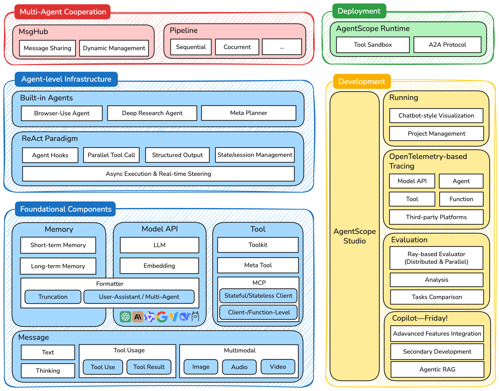

# AgentScope：工程化多智能体平台

> 阿里达摩院出品的消息驱动、支持分布式部署的多智能体平台，主打工业级可靠性。

## 核心原理和流程

> 简记：**消息为基、组合架构、分布式部署、结构化约束**。

四层分层架构（自底向上）：
1. **基础组件层**：`Msg`（统一消息格式）、`Memory`、`Model API`、`Tool`
2. **智能体基础设施层**：`AgentBase` 基类、ReAct 范式、异步执行
3. **多智能体协作层**：`MsgHub`（消息中心）+ `Pipeline`（工作流编排）
4. **开发与部署层**：`AgentScope Runtime`（运行时）+ `AgentScope Studio`（可视化）

**消息驱动**是核心创新——所有智能体交互被抽象为 `Msg` 的收发，而非函数调用：

<div align="center">
  
  <p>AgentScope架构图</p>
</div>

## 核心流程代码
```python
from agentscope.message import Msg
from agentscope.agents import AgentBase

# 标准消息结构：name + content + role + metadata
message = Msg(name="Alice", content="Hello!", role="user",
              metadata={"timestamp": "...", "message_type": "text"})

# 自定义智能体只需实现 reply()
class CustomAgent(AgentBase):
    def reply(self, x: Msg) -> Msg:
        response = self.model(x.content)
        return Msg(name=self.name, content=response, role="assistant")
```

**MsgHub** 是消息中枢，支持点对点、广播、组播，并可持久化 + 原生 RPC 分布式：

```python
# 动态创建临时私密频道（如狼人杀的狼人讨论）
async with MsgHub(
    self.werewolves,
    enable_auto_broadcast=True,
    announcement=await self.moderator.announce("讨论击杀目标"),
) as hub:
    for wolf in self.werewolves:
        await wolf(structured_model=DiscussionModelCN)
```

**结构化输出**（Pydantic 模型）把游戏规则变成代码约束：

```python
class WitchActionModelCN(BaseModel):
    use_antidote: bool = Field(description="是否使用解药")
    use_poison: bool = Field(description="是否使用毒药")
    target_name: Optional[str] = Field(description="毒药目标玩家姓名")
```

## 易错点

> **用函数调用思维写消息驱动**：习惯同步阻塞调用，忘记 AgentScope 是异步消息驱动。
> 理解 `Msg` 收发模式，用 `async/await` 和 `Pipeline` 编排并发。

> **分布式部署忽视消息顺序性**：多节点 RPC 下消息可能乱序，实时游戏状态不一致。
> 关键阶段加序号/锁；`fanout_pipeline` 用 `enable_gather=False` 保证收集完整。

> **单个智能体异常拖垮全局**：某个 Agent 报错未捕获，整个 Pipeline 中断。
> 关键环节 try/except，创建默认响应兜底，保证流程继续。

> **过度工程化简单场景**：简单多轮对话也上分布式消息架构，开发成本过高。
> 简单原型用 AutoGen/CAMEL，只有需要高并发/分布式/长时运行才上 AgentScope。

## 练习

- Q1：AgentScope 的消息驱动相比传统函数调用有什么优势？
  A1：①异步解耦（收发方时间上不阻塞）②位置透明（本地/远程透明路由）③可观测（消息可记录追踪）④可靠（可持久化重试，保证最终一致性）。

- Q2：`MsgHub` 的三大核心能力是什么？
  A2：灵活路由（点对点/广播/组播）、消息持久化（SQLite/MongoDB）、原生分布式（跨节点 RPC 自动路由）。

- Q3：AgentScope 如何用代码约束游戏规则（如狼人杀）？
  A3：用 Pydantic `BaseModel` 定义结构化输出模型（如 `WitchActionModelCN`），字段约束 + 验证逻辑自动执行规则，智能体无法输出违规动作。

## 知识关联

- 前置：[[ReAct 智能体范式]]、异步编程、消息队列/Actor 模型
- 横向：[[AutoGen 对话驱动多智能体框架]]、[[CAMEL 角色扮演协作框架]]、[[LangGraph 图结构工作流框架]]
- 进阶：分布式系统一致性（Paxos/Raft）、容错恢复、可观测性（Tracing）

## 对比与选型

| 方案 | 核心思想 | 灵活性 | 稳定性 | 最佳场景 |
|------|---------|--------|--------|----------|
| AgentScope | 消息驱动 + 分布式 | 中 | 高 | 高并发/分布式生产级系统 |
| AutoGen | 群聊对话驱动 | 高 | 中 | 流程化多角色协作 |
| CAMEL | 角色扮演 | 高 | 中 | 双专家深度协作 |
| LangGraph | 状态机 + 有向图 | 中 | 高 | 精确流程控制 |

**选型速查**：要高并发/分布式/长时稳定运行选 AgentScope；要快速对话协作原型选 AutoGen/CAMEL。

## 执行意图

- If 我要构建**大规模、高并发、需分布式部署**的生产级多智能体系统（如实时游戏、大规模客服），then 选 AgentScope 的消息驱动架构。
- If 我只做简单多轮对话原型却准备上 MsgHub + 分布式，then 停下来，这是过度工程化，用 AutoGen 更合适。

## 参考

- [AgentScope 官方文档](https://doc.agentscope.io/)
- [AgentScope 论文 (arXiv:2402.14034)](https://arxiv.org/abs/2402.14034)
- 代码示例见仓库 `agentscope/` 目录下的三国狼人杀案例
