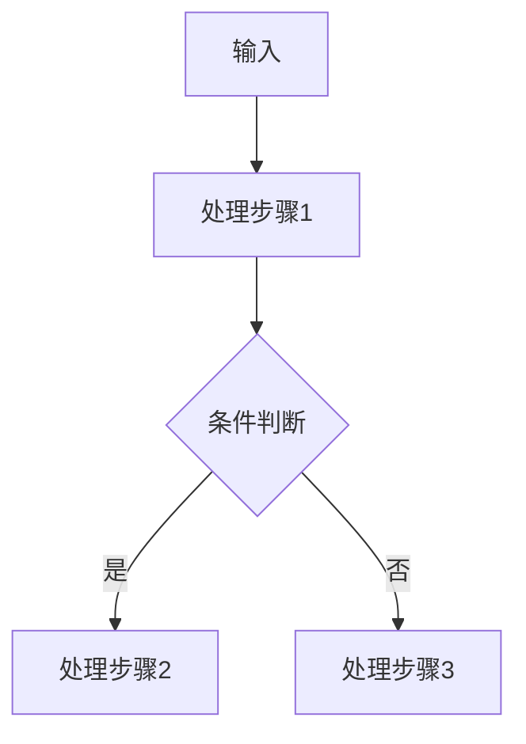

# [排序算法：笔记标题]

> **🚀 核心目标**：读完这篇笔记，我能用自己的话把 [排序算法核心概念] 讲给一个完全不懂技术的朋友听，并且能随手写出核心代码。

---

## 🧠 第一部分：费曼入门（Feynman Introduction）

> **⚡ 黄金法则：禁止直接复制定义！必须用自己最通俗的语言重新组织。**

### 1.1 这是什么？（一句话说人话）

**用大白话定义**：
> 请在此写下你对这个概念最直觉的理解，尽量不用专业术语。

### 1.2 生活类比（Analogy）

**用一个生活场景帮助记忆**：
> 请在此写下一个生动形象的类比。

### 1.3 为什么我要学它？（解决什么痛点）

> 面试官爱问"你为什么用它"，写下来：

- **如果没有它**，我会面临什么麻烦？
- **有了它**，我解决了什么具体问题？

---

## 🔬 第二部分：技术深度拆解（Deep Dive）

> **注意**：在写这部分之前，先问自己"我刚才的类比在技术细节上是否准确？"，查漏补缺。

### 2.1 核心机制（原理 / 数学 / 流程图）

**文字描述**：
请在此用专业但清晰的语言描述内部运作逻辑。

**流程图（Mermaid）**：


**核心公式（如有）**：
$$
\text{公式占位}
$$

### 2.2 关键代码片段（核心逻辑）

> 仅展示最精炼的核心逻辑（10~20 行），完整可运行代码放在第三部分。

```python
# 在此写出最核心的 10~20 行逻辑（Python 3.10+，必须带类型注解）
def core_logic(data: list[int], threshold: int = 10) -> int | None:
    ...
```

---

## 💻 第三部分：纸上得来终觉浅（Runable Code）

> **费曼强制输出**：此处的代码必须是**你自己手写**（或完全理解后重打的），带详细的注释，像在教别人写代码一样。

### 3.1 完整可运行示例

```python
# 完整可运行示例（Python 3.10+，带类型注解）
from collections.abc import Callable


def main() -> None:
    # 在此写出完整可运行的核心逻辑
    ...


if __name__ == "__main__":
    main()
```

---

## ⚖️ 第四部分：权衡与面试视角（Trade-offs）

> 必须包含对比表格，这是面试高频区。

| 对比维度 | 方案 A（本文主角） | 方案 B（替代方案） | 方案 C（替代方案） |
| :--- | :--- | :--- | :--- |
| **优点** | | | |
| **缺点** | | | |
| **适用场景** | | | |

**📌 面试官追问**：如果让你重新选型，在 [某种特定限制下] 你会怎么选？为什么？

---

## 🔗 第五部分：关联知识 & 踩坑回忆

> **费曼连接**：这个知识点让我想起了之前学过的什么？搞砸过什么？

### 5.1 常见踩坑（Pitfalls）

- **坑点 1**：描述踩坑现象。
  - **原因**：分析为什么。
  - **解决**：附上解决方案。

- **坑点 2**：（可选）

### 5.2 关联笔记

- 依赖前置知识：[[08-Algorithms-DSA/Searching/xxx.md]]（搜索算法）
- 进阶方向：[[08-Algorithms-DSA/DP-Greedy/xxx.md]]（动态规划与贪心）
- 相关踩坑记录：[[10-Debug-Log/index.md]]

---

## 🗣️ 第六部分：费曼闭环——讲给小白听（强制输出）

> **🎯 真正的掌握，是能把厚书读薄。写完下面这段，这篇笔记才算真正完结。**

### 6.1 终极一句话（Twelve-Word Summary）

**用 12 个字以内总结本文核心**：
> 请在此填写：

### 6.2 向 8 岁小孩解释

> 想象你面前坐着一个 8 岁小孩或非技术背景的朋友，用 3-5 句话讲明白今天学的这个东西。不能出现专业黑话。

**我的解释**：
> 请在此写满 3-5 句话：

### 6.3 如果我忘了，我只要记住……

> 给自己留一句"作弊小抄"，将来回看这篇笔记时，只看这句就能想起 80% 的内容。

> 请在此填写：

---

## 📚 参考与扩展（Bibliography）

- [论文/官方文档标题](链接)
- [优质博客/教程标题](链接)
- [推荐书籍章节]

---

> **📝 审核记录**：本文 [是/否] 借助 AI 辅助生成，内容经手动校验。  
> **最后更新**：YYYY-MM-DD
