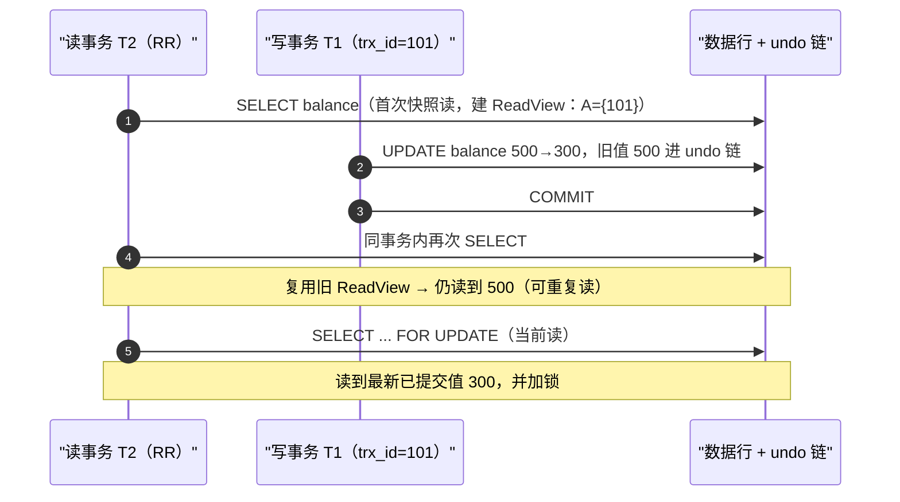

# 事务 ACID 与隔离级别（MVCC）

## 定义

事务（Transaction）把一组对数据库的读写操作打包成不可分割的执行单元：要么全部生效（COMMIT），要么全部撤销（ROLLBACK），中间状态绝不暴露给其他会话。典型场景是转账——A 扣款与 B 入账必须同生共死，任何一步失败都不能留下"扣了没到"或"到了没扣"的账。

事务的正确性由 ACID 四条性质刻画（取英文首字母）：

- **原子性 Atomicity**：单元内操作全成或全败。失败时靠 undo log（回滚日志）把已执行部分恢复原状。
- **一致性 Consistency**：事务执行前后数据库都满足业务约束（余额非负、外键、唯一键等）。一致性是目标，其余三条是实现手段。
- **隔离性 Isolation**：并发事务互不可见对方的中间状态。强弱由**隔离级别**刻画：ANSI SQL-92 定义了 Read Uncommitted、Read Committed、Repeatable Read、Serializable 四级，级别越高越接近串行执行、并发度越低，分别对应脏读、不可重复读、幻读等异常的被消除程度。
- **持久性 Durability**：COMMIT 后即使宕机数据也不丢，靠 redo log 预写（WAL，Write-Ahead Logging）+ 崩溃恢复保证。

**MVCC（Multi-Version Concurrency Control，多版本并发控制）** 是隔离性的主流实现思路：不为"读"加锁，而是给每一行保留多个历史版本，读事务按自己的**快照（ReadView）**找到合适的版本读取，从而做到**读不阻塞写、写不阻塞读**。其适用范围是单机/存储引擎层的 OLTP 并发控制，InnoDB、PostgreSQL、Oracle 均为代表；跨节点需要原子提交的场合（2PC/TCC/Saga）和无事务语义的存储不在此列，而 TiDB/CockroachDB 这类 NewSQL 把 MVCC 扩展到了分布式层面。

## 原理

为什么不让读写通过全加锁串行化？读锁与写锁互斥会让读写互相阻塞，读多写少的系统吞吐被急剧拉低；而真实业务中写冲突占比很小，所以 MVCC 的思路是**用写时的空间开销（多存几个旧版本）换取读时零阻塞**——读不加锁，冲突检测推迟到写提交阶段（配合行锁/间隙锁或版本校验），本质是"乐观并发"在数据库内核里的实现。

以 InnoDB 为例，核心机制分三块。**(1) 版本链**：聚簇索引记录上有两个隐藏列——`DB_TRX_ID`（最近修改该行的事务 id，6 字节）与 `DB_ROLL_PTR`（回滚指针，7 字节）。UPDATE 不是原地覆盖：旧值连同老 `trx_id` 先拷贝进 undo log 形成"旧版本"，再写入新值，指针把新旧版本串成链：


**(2) ReadView 判可见**：读事务首次一致性读时生成 ReadView，记录四件事：活跃（未提交）事务集合 `trx_ids`、集合最小 id `min_trx_id`、下一个待分配的事务 id `max_trx_id`、自己 `creator_trx_id`。随后从链头（最新版本）沿 `roll_pointer` 向旧找，设版本由事务 $t$ 产生，可见性规则（教材式简化模型）为：

$$
\begin{aligned}
\text{该版本可见} &\iff t=\text{creator\_trx\_id} &&(\text{本事务自写的版本})\\
&\lor\ t<\text{min\_trx\_id} &&(\text{快照建立前已提交})\\
&\lor\ \big(t<\text{max\_trx\_id}\ \land\ t\notin \text{trx\_ids}\big) &&(\text{快照前已启动且已提交})\\
\text{不可见} &\iff t\in \text{trx\_ids}\ \lor\ t\ge \text{max\_trx\_id} &&(\text{活跃中/快照后才启动})
\end{aligned}
$$

即"比我快照老且已提交"或"自己写的"才可见；仍在活跃列表里、以及快照之后才开始的事务（$t\ge \text{max\_trx\_id}$）产生的版本不可见，继续沿链向前找第一个可见版本。工程实现还需处理删除标记与 purge 清理，细节以各引擎文档为准。

**(3) 隔离级别 = ReadView 使用策略 + 锁**，四级的差别在于"快照多久换一次"：

- **Read Uncommitted**：不建 ReadView，直接读最新版本，可能**脏读**；
- **Read Committed（RC）**：每条 SELECT 都生成新 ReadView → 语句级一致，事务内两次读结果可能不同（**不可重复读**）；
- **Repeatable Read（RR）**：只在事务内**第一次快照读**时生成 ReadView 并整事务复用 → 事务级一致（可重复读），InnoDB 默认级别；
- **Serializable**：InnoDB 在关闭 autocommit 时把普通 SELECT 隐式转为共享锁读，用锁把并发真正串行化。

务必区分两类读：普通 `SELECT` 是**快照读**（走 MVCC，不加锁）；`SELECT ... FOR UPDATE`、`LOCK IN SHARE MODE`、`UPDATE`、`DELETE` 是**当前读**——读最新已提交版本并加锁。InnoDB 的 RR 靠 next-key 锁（记录锁+间隙锁）防住当前读的**幻读**，快照读则因固定 ReadView 天然看不到快照之后插入的行，时序如下：



收尾机制：**回滚**靠 undo 反向恢复旧版本实现原子性；**崩溃恢复**靠 redo 前滚实现持久性；旧版本不再被任何活跃 ReadView 需要时，由后台线程清理（InnoDB 的 purge 线程；PostgreSQL 无独立 undo log，旧元组留在堆内由 VACUUM 回收，其 Serializable 用 SSI 在提交时检测冲突并报 40001 让应用重试）。因此**长事务或长期不提交的读**会让旧版本持续"被需要"，undo 段无限膨胀——这是 MVCC 最典型的运维坑。

## 应用

典型场景：资金转账/余额扣减、库存扣减与订单一致性（校验-扣减-记账在一个事务内）、并发热点的先读后写（领券、签到）、以及要求"报表与写入互不阻塞"的一致性读。隔离级别按需取：绝大多数 OLTP 用数据库默认值即可（InnoDB 默认 RR、PostgreSQL/SQL Server 默认 RC）；只有硬性要求写串行化才上 Serializable；需要"读到即锁住"时用 `SELECT ... FOR UPDATE`，别指望快照读能锁住别人。

快速上手（以 MySQL 为例）：先 `SET SESSION TRANSACTION ISOLATION LEVEL REPEATABLE READ;` 并用 `SELECT @@transaction_isolation;`（PostgreSQL 用 `SHOW transaction_isolation;`）确认；再 `BEGIN;` 或 `START TRANSACTION` 执行业务 DML，全部成功 `COMMIT;`，任一步异常 `ROLLBACK;`；排查事务/锁时用 `SHOW ENGINE INNODB STATUS\G` 看事务列表、锁等待与最近死锁。Python 侧注意驱动默认行为：sqlite3 默认"隐式开事务"，psycopg2 / PyMySQL 一般要显式 `BEGIN` 并 `commit()` / `rollback()`，且要留意连接池归还连接前是否残留未提交事务。

常见坑：

- MySQL 默认 **autocommit=1**，每条 SQL 自成事务，多语句"事务"必须显式 BEGIN；
- 忘 COMMIT 的长事务：持锁不释放、ReadView 不释放 → undo 膨胀、从库延迟、莫名锁等待，是死锁排查第一嫌疑人；
- **先读后写不隔离**：RR 快照读拿到的旧值不能作为写决策依据（写是当前读），两次判断之间别人可能已提交 → 覆盖更新/丢更新（lost update）。解法：`SELECT ... FOR UPDATE` 加锁读，或乐观 CAS：`UPDATE t SET version=version+1 WHERE id=? AND version=?`，影响行数为 0 时重试；
- 死锁无法完全消除：InnoDB 会检测并回滚代价较小的一方（错误码 1213），业务层必须捕获并重试；
- 更新条件没走索引时，RR 的间隙锁可能退化为锁全表；大批量 UPDATE/DELETE 应拆小批执行；
- 别拿单机事务当分布式事务：跨库/跨服务一致性需要 2PC、TCC、Saga 或消息最终一致（如 Seata）。

```python
# 事务 ACID 与隔离级别（MVCC）—— sqlite3 可运行示例
# 说明：SQLite 不是 InnoDB 式 undo 版本链，但 WAL 模式会保留旧页帧，
# 使读事务能"不被写阻塞地读到一致旧快照"，足以演示 MVCC 的核心语义。
import os, sqlite3

DB = "mvcc_demo.db"
for f in (DB, DB + "-wal", DB + "-shm"):        # 清理上次残留（含 WAL 附属文件）
    try: os.remove(f)
    except FileNotFoundError: pass

write = sqlite3.connect(DB, isolation_level=None)  # None => autocommit，显式 BEGIN/COMMIT
write.execute("PRAGMA journal_mode=WAL")           # WAL：读者与写者并发、互不阻塞
write.executescript("""
    DROP TABLE IF EXISTS accounts;
    CREATE TABLE accounts(id INTEGER PRIMARY KEY, name TEXT, balance INTEGER);
    INSERT INTO accounts VALUES (1, 'alice', 500);  -- executescript 自带隐式提交
""")

# ---- 案例 A：原子性：业务校验失败 -> 整体回滚，余额恢复 500，不会出现 -100 ----
try:
    write.execute("BEGIN")
    write.execute("UPDATE accounts SET balance = balance - 600 WHERE id = 1")  # 500-600=-100
    if write.execute("SELECT balance FROM accounts WHERE id=1").fetchone()[0] < 0:
        raise RuntimeError("余额不足，触发回滚")
    write.execute("COMMIT")
except RuntimeError:
    write.execute("ROLLBACK")                      # 撤销本事务全部修改
print("A 原子性（期望余额 500）:", write.execute("SELECT balance FROM accounts WHERE id=1").fetchone())

# ---- 案例 B：快照隔离：读事务按自己的快照读旧版本，不受并发提交影响 ----
write.execute("UPDATE accounts SET balance = 800 WHERE id = 1")  # autocommit，立即提交

read = sqlite3.connect(DB, isolation_level=None)
read.execute("BEGIN")                              # 读事务开始，快照在首次读时建立
print("B1 快照内（期望 800）:", read.execute("SELECT balance FROM accounts WHERE id=1").fetchone())

write.execute("UPDATE accounts SET balance = 1000 WHERE id = 1")  # 另一连接并发提交新值
print("B2 同一快照内（期望仍 800，读的是旧版本）:", read.execute("SELECT balance FROM accounts WHERE id=1").fetchone())

read.execute("COMMIT")                             # 读事务结束，快照释放
print("B3 新读事务（期望 1000）:", read.execute("SELECT balance FROM accounts WHERE id=1").fetchone())

write.close(); read.close()
for f in (DB, DB + "-wal", DB + "-shm"):
    try: os.remove(f)
    except FileNotFoundError: pass
```

案例详解：运行输出依次为 `A 原子性（期望余额 500）: (500,)`、`B1 ...: (800,)`、`B2 ...: (800,)`、`B3 ...: (1000,)`。案例 A 中 UPDATE 把 500 扣成 -100 后业务校验抛出异常，`ROLLBACK` 使整笔事务恢复原状——原子性由回滚机制保证（对应 InnoDB 的 undo log）。案例 B 是关键：连接 `read` 首次 SELECT 时建立快照并读到 800；随后连接 `write` 并发提交 1000，`read` 在同一事务内第二次 SELECT 仍返回 800（MVCC 读历史版本，写不被阻塞也看不到），直到它 COMMIT 后新事务才读到 1000——这正是 RR/快照隔离"可重复读"的效果。若把第二次读换成 `UPDATE ... WHERE id=1`（当前读），则会读到并锁住最新的 1000，这也是"先读后写必须用 FOR UPDATE"的原因。注意 SQLite 靠 WAL 旧页帧而非 undo 版本链实现快照，本示例仅演示"读事务一致性快照"这一共同语义，级别的具体差异请以 InnoDB/PostgreSQL 为准。

---
## 关联
- 前置：[[索引原理与B+树-note]]——版本链与回滚指针挂在聚簇索引记录上，B+ 树的行定位能力是理解"版本与锁落在哪些行"的前提
- 类似：[[进程线程与协程-note]]（区别是：进程/线程/协程管理的是执行流与资源调度，事务隔离管理的是这些执行流对共享数据的并发访问一致性）
- 进阶：[[IO模型-note]]——redo/undo 落盘时机、组提交与 fsync 语义决定了崩溃恢复窗口，是 MVCC 之外理解"持久性"的 IO 基础

---
## 对比选型
| 方案 | 核心思想 | 最佳场景 |
|------|---------|----------|
| 本文方案：MVCC 快照隔离（InnoDB 默认 RR） | 写时生成新版本、读按 ReadView 沿版本链找可见版本，读不加锁、读写互不阻塞 | 读多写少的 OLTP，需要事务内一致性读与高并发读 |
| 悲观锁（2PL 两阶段封锁） | 读/写先加锁、事务结束才释放，冲突即阻塞等待 | 写冲突极高、要求"读到的就锁住"的强一致场景（Serializable、FOR UPDATE 当前读） |
| 乐观并发（版本号/CAS） | 全程不加锁，提交时校验版本/条件，失败则重试 | 写冲突率低、追求零阻塞高吞吐；常用于 Redis/MongoDB 等无 MVCC 存储的应用层实现 |
| 分布式事务（2PC/TCC/Saga） | 跨节点协调提交、补偿或消息最终一致 | 单机事务覆盖不到的跨库/跨服务一致性（XA、Seata 等中间件） |

---
## 参考
- [MySQL 8.0 Reference Manual: InnoDB Multi-Versioning](https://dev.mysql.com/doc/refman/8.0/en/innodb-multi-versioning.html)
- [MySQL 8.0 Reference Manual: Transaction Isolation Levels](https://dev.mysql.com/doc/refman/8.0/en/innodb-transaction-isolation-levels.html)
- [PostgreSQL Documentation: Concurrency Control（MVCC 与 SSI）](https://www.postgresql.org/docs/current/mvcc.html)
- [SQLite: Write-Ahead Logging（WAL）](https://www.sqlite.org/wal.html)

---
## 具体案例
- [[事务 ACID 与隔离级别（MVCC） 实战示例]](事务 ACID 与隔离级别_sample.py)
