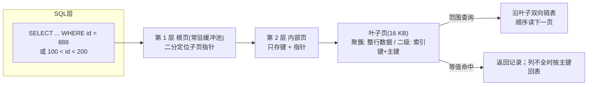

# MySQL 索引原理：B+ 树

## 定义

B+ 树是一种多路平衡查找树，InnoDB（MySQL 默认存储引擎）用它来组织表数据与二级索引，索引的本质是"把一次查询触发的磁盘 IO 压到常数级"的查找结构。B+ 树的每个节点是一个**页**（InnoDB 默认 16 KB），可容纳远多于二叉树的子节点，因此树极矮：百万到亿级记录通常只有 2~4 层，而每一层恰好对应一次页 IO。

相比普通 B 树，B+ 树有两个决定性特征：一是**数据只存放在叶子节点**，非叶子节点仅存"键 + 子页指针"，于是单页能放下更多键、树更矮，且非叶子层（尤其根与内层）极易常驻缓冲池；二是叶子节点之间用**双向链表**按键有序串接，范围扫描、ORDER BY、去重都能沿链表顺序推进，不必回溯上层。

它解决的问题：无索引时 InnoDB 只能全表扫描，每个数据页都要读入比对；有了 B+ 树索引，等值、范围、排序、前缀匹配都以"树高层数次 IO + 叶子顺序读"完成。哈希索引只能等值、跳表与二叉树在磁盘场景树高或 IO 不理想，B+ 树正是"等值 + 范围 + 有序输出"三者通吃的设计。

适用范畴：MySQL/InnoDB 的主键（聚簇）索引与二级索引、多数关系型数据库（PostgreSQL 等）的默认索引结构。不适合的领域包括：近似最近邻（向量）检索、以超高频追加写为主的日志型负载（更适用 LSM-Tree）、以及纯等值查询且数据可常驻内存的场景（哈希索引更快）。

## 原理

### 为什么是"矮胖树"而不是平衡二叉树
二叉树/红黑树每个节点两个分支，树高约 $\log_2 N$：10 亿行约 30 层，若每层一次随机磁盘 IO（约 10 ms），单次查询近 300 ms，不可接受。B+ 树每个页最多 $m$ 个分支，树高约 $\log_m N$；$m$ 由页大小与键宽决定：16 KB 页、bigint 主键（8 B）+ 页指针（6 B）≈ 14 B/键，则 $m \approx 16384 / 14 \approx 1170$，10 亿行时树高 $\approx \lceil \log_{1170} 10^9 \rceil = 3$。因此一次等值查找约 3 次页读取，且根/内层页常驻内存后真实磁盘 IO 通常只剩 1~2 次，这正是 B+ 树针对磁盘 IO 的核心优化：用树高换 $O(\log N)$ 的常数化 IO。

### 查找 / 范围 / 写入流程
- 等值查找：从根页二分定位子指针，逐层下降至叶子页，再在页内二分定位记录，页 IO 数 $O(\log_m N)$，页内键比较 $O(\log B)$（$B$ 为页内键数）。
- 范围查找：先在叶子链上二分定位左边界，再沿叶子双向链表顺序推进，命中连续页（多为顺序 IO），代价 ≈ 定位 IO + 结果页数，与结果集大小线性相关而非全表。
- 插入/删除：先定位目标叶子；页满则从 $m/2$ 处分裂、把中间键提升到父节点（可能连锁分裂到根，树高 +1）；删除后页过空则与兄弟合并或借键，始终保证所有叶子同层——即"平衡"。



### 聚簇索引、二级索引与回表
InnoDB 中表数据本身就存储在**主键 B+ 树**的叶子页上（聚簇索引，表即索引），二级索引叶子存"索引列值 + 主键值"。若查询所需列不全在二级索引中，需要拿主键回聚簇索引再读整行（回表，多一次树查找 IO）。最左前缀匹配、索引下推（ICP）、覆盖索引（叶子即含全部所需列，Extra 显示 Using index）等优化，本质上都是围绕"减少回表与减少读页数"展开的。页内二分、层间指针、叶子链表三者配合，使读写都能以接近顺序 IO 的代价完成。

## 应用

典型场景：主键等值/范围查询、带 WHERE 条件的 OLTP 查询、ORDER BY/GROUP BY/DISTINCT 的有序聚合、JOIN 关联列（连接时对被驱动表走索引）、UNIQUE 约束（唯一索引强制执行）等。联合索引遵循**最左前缀**：(a, b) 索引可加速 a 与 a+b 的查询，却无法单独加速 b 的过滤。

快速上手：① 建表时选紧凑自增主键，避免页分裂与碎片；② 对高频过滤/排序列执行 `CREATE INDEX` 或 `CREATE UNIQUE INDEX`；③ 用 EXPLAIN 检查 type（const/ref/range/index/all）、key、key_len，Extra 中的 Using index（覆盖）、Using filesort / Using temporary（缺合适索引）等信号；④ 尽量让二级索引覆盖所需列或借助索引下推，减少回表。

常见坑：① 对低选择性列（性别、status）建索引收益极低还放大写入成本；② 索引列上套函数或隐式类型转换导致索引失效，如 `WHERE DATE(created_at) = ...`、字符串列与数字比较；③ 前导模糊 `LIKE '%xx'` 用不上索引；④ UUID 类随机字符串主键引起频繁页分裂与碎片、缓冲池颠簸；⑤ 违反最左前缀、OR 混合条件、排序方向不一致都可能退化为全表扫描或 filesort；⑥ 二级索引每棵都复制一份主键，主键过长会整体撑大索引，故聚簇索引键宜小。事务隔离中的间隙锁（next-key lock）也是锁定在索引记录上，索引结构直接决定加锁粒度与死锁行为。

```sql
-- 验证联合索引是否生效: (city, age) 满足最左前缀
EXPLAIN SELECT id, city, age FROM t_user
WHERE city = '上海' AND age BETWEEN 20 AND 30
ORDER BY age;
-- 期望: type=range, key=idx_city_age, Extra=Using index(覆盖);
-- 若出现 Using filesort, 说明排序字段未能沿索引推进
```

```python
import bisect
import math


def btree_search_cost(n_rows, page_bytes=16 * 1024, key_bytes=8, ptr_bytes=6):
    """估算 B+ 树查找的页 IO 次数。

    m: 单页扇出 = 页大小 / (键宽 + 子页指针宽)
    树高 h ≈ ceil(log_m(N))，h 同时也是一次查询访问的页数。
    """
    m = page_bytes // (key_bytes + ptr_bytes)   # 内部页最多几个子指针
    h = math.ceil(math.log(n_rows, m)) if n_rows > 1 else 1
    return h, m


def leaf_search(sorted_keys, target):
    """在一个有序叶子页内做二分（bisect 模拟页内二分）。"""
    i = bisect.bisect_left(sorted_keys, target)
    if i < len(sorted_keys) and sorted_keys[i] == target:
        return i, "命中: 聚簇索引叶子页上即为整行数据"
    return -1, f"未命中: 应插入第 {i} 个键之后——范围查询即从此处开始扫描"


if __name__ == "__main__":
    n = 100_000_000                       # 1 亿行
    h, m = btree_search_cost(n)
    print(f"1 亿行: 树高 ≈ {h} (约 {h} 次页 IO), 每页扇出 {m}")

    page = list(range(0, 1000, 2))        # 模拟一个有序叶子页
    idx, msg = leaf_search(page, 666)     # 等值查询
    print("等值:", msg)
    lo = bisect.bisect_left(page, 200)    # 范围查询: 二分定位左边界
    print("范围 [200, 210] 返回:", page[lo:bisect.bisect_right(page, 210)])
```

案例详解：`btree_search_cost` 复现"为什么树这么矮"的推导——1 亿行、bigint 主键下树高仅 3，即一次查询最多约 3 次页 IO（根页常驻内存后真实磁盘读通常只剩 1~2 次），而同等数据量的平衡二叉树需约 27 层。`leaf_search` 演示页内二分：等值命中即可取整行（聚簇索引语义）；未命中时返回的插入位置正是范围查询起点，对应 B+ 树"范围扫描沿叶子双向链表顺序推进"的行为。程序输出约 `1 亿行: 树高 ≈ 3 … 每页扇出 1170`，与真实 InnoDB 的量级一致（具体随页大小与键宽浮动）；上方的 SQL 示例则展示如何用 EXPLAIN 验证索引真正生效。

---
## 关联
- 前置：[[IO模型-note]]——B+ 树把随机磁盘 IO 压成常数次的矮树设计，前提是理解随机 IO 与顺序 IO 的代价差异。
- 类似：[[向量数据库-note]]——向量索引走 ANN/HNSW 等近似最近邻，不做有序键比较，无法直接支撑精确等值/范围 SQL，适用面不同。
- 进阶：[[事务与隔离级别-note]]——InnoDB 行锁与间隙锁都定位在索引记录上，索引结构直接影响锁粒度、幻读处理与死锁形态。

---
## 对比选型
| 方案 | 核心思想 | 最佳场景 |
|------|---------|----------|
| B+ 树（本文，InnoDB） | 非叶子只存键、叶子存数据并以双向链表有序串接，等值/范围/排序通吃 | 关系库 OLTP 精确查询、范围过滤、有序输出 |
| B 树 | 数据分散存储在各层节点，查找时无需下沉到叶子 | 嵌入式/内存型单点查找，或需要就近访问相邻键的场景（早期文件系统目录索引） |
| 哈希索引 | 键经哈希函数 O(1) 定位槽位 | 仅等值查询且数据可入内存（MySQL Memory 引擎；InnoDB 自适应哈希索引加速热点等值读） |
| LSM-Tree | 内存 memtable + 有序 SSTable 追加写并归并落盘，把随机写转顺序写 | 写入吞吐优先的日志型负载（RocksDB、LevelDB、TiKV），以读放大换写性能 |

---
## 参考
- [MySQL 8.0 Reference Manual: Comparison of B-Tree and Hash Indexes](https://dev.mysql.com/doc/refman/8.0/en/index-btree-hash.html)
- [MySQL 8.0 Reference Manual: InnoDB Physical Structure（索引页与 B 树）](https://dev.mysql.com/doc/refman/8.0/en/innodb-physical-structure.html)
- [Comer, D. The Ubiquitous B-Tree. ACM Computing Surveys, 1979](https://dl.acm.org/doi/10.1145/356770.356776)

---
## 具体案例
- [[MySQL 索引原理：B+ 树 实战示例]](MySQL 索引原理：B+ 树_sample.py)
