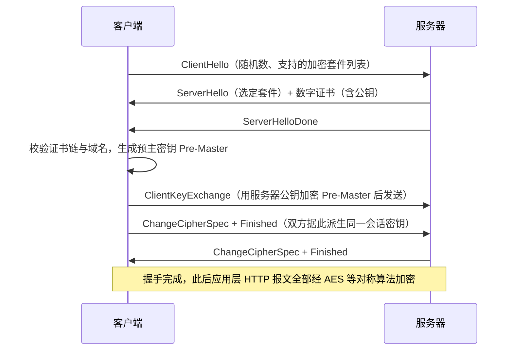

# HTTP 与 HTTPS 协议

## 定义

HTTP（HyperText Transfer Protocol，超文本传输协议）是 Web 世界最基础的应用层协议，采用**客户端-服务器模型 + 请求/响应**的消息交换方式：客户端（浏览器、App、爬虫）发起请求，服务器解析后返回状态码与正文。它源自 1991 年的 HTTP/0.9，历经 HTTP/1.0、HTTP/1.1（RFC 9112）、HTTP/2（RFC 9113）演进，语义标准统一收敛在 RFC 9110（HTTP Semantics）。

它解决的核心问题：TCP 只提供"可靠的字节流"，本身没有任何报文语义。HTTP 在字节流之上定义了统一、可扩展的**报文格式（起始行 + 头部 + 空行 + 正文）**与**资源寻址方式（URI）**，让浏览器、服务器、CDN、代理、网关这些异构系统用同一种语言协作，并支撑起缓存、认证、范围请求、内容协商等 Web 工程能力。

核心特征：①**无状态**——服务器默认不记忆两次请求间的关系，靠 Cookie/Session/Token 补充会话能力；②**可扩展**——头部字段可自由扩展（Content-Type、Cache-Control、Authorization 等）；③**媒体类型协商**——通过 MIME 类型让同一资源能以多种形式返回；④**明文传输**——HTTP 自身不提供任何加密，报文可被抓包工具直接读出。

HTTPS（HTTP over TLS）＝保持 HTTP 语义不变，在其下层（TCP 之上）插入一层 **TLS/SSL** 加密协议，默认端口 443。它针对明文 HTTP 的三大致命弱点设计：**窃听**（报文可被读取）、**篡改**（中间人改写内容）、**伪装**（无法确认对方真实身份）。

适用范畴：网页浏览、前后端 REST/GraphQL API、小程序与 App 接口、WebSocket 升级握手、经代理/CDN 的所有公网流量；明文 HTTP 如今仅建议用于本地调试、内网非敏感服务和公开只读静态资源。

## 原理

**协议分层定位**：HTTP/HTTPS 位于应用层，下层依赖 TCP 的可靠传输，数据流向为 `HTTP 报文 →（HTTPS 时先送入 TLS 记录层加密）→ TCP 段 → IP 包 → 以太网帧`。因此 TCP 的握手时延、拥塞控制与连接复用，会直接传导到 HTTP 的响应速度上。

**报文格式（关键细节）**：请求报文 = `请求行`（方法 + URI + 版本，如 `GET /index.html HTTP/1.1`）+ 若干头部行 + 空行（CRLF）+ 可选正文；响应报文 = `状态行`（版本 + 状态码 + 原因短语，如 `HTTP/1.1 200 OK`）+ 头部 + 空行 + 正文。常用方法：GET、POST、PUT、DELETE、HEAD、OPTIONS、PATCH。状态码按首位数字分类：1xx 信息、2xx 成功、3xx 重定向、4xx 客户端错误、5xx 服务端错误。

**关键机制**：
- 无状态补偿：服务器通过 `Set-Cookie` 下发标识，后续请求携带 `Cookie` 恢复会话；现代 API 更多使用 Authorization 头传 Token。
- 连接管理：HTTP/1.1 默认 **Keep-Alive** 复用 TCP 连接，但同一连接上响应必须按序返回（队头阻塞），故浏览器对同域并发开 6 条左右连接；HTTP/2 用二进制分帧 + 多路复用解决之。
- 幂等与缓存：GET/HEAD 等幂等方法可安全被缓存代理复用，配合 `Cache-Control`、`ETag`、`Last-Modified` 等头部减少回源。

**HTTPS 为什么采用"混合加密"**：对称加密（AES）速度快，但密钥如何安全送达对方是难题；非对称加密（RSA/ECC）可安全交换密钥，但速度比对称加密慢 2~3 个数量级。于是 TLS 用**非对称加密完成身份认证与密钥协商**，协商出的会话密钥再驱动**对称加密**保护业务数据，兼得安全与性能。其信任根基是证书体系：CA 用自己的私钥为"域名 ↔ 公钥"绑定关系签名，客户端用系统内置的 CA 公钥验证证书链，从而抵御中间人伪造。

**握手成本（关键推导）**：TLS 1.2 完整握手需 2 个额外 RTT，首次建立 HTTPS 连接总时延为

$$
T_{\text{HTTPS 首连 (TLS 1.2)}} = 1\,\text{RTT}_{\text{TCP}} + 2\,\text{RTT}_{\text{TLS}} = 3\,\text{RTT},\qquad \text{明文 HTTP 仅 } 1\,\text{RTT}_{\text{TCP}}
$$

TLS 1.3（RFC 8446）将完整握手压缩到 1-RTT，并支持会话恢复与 0-RTT 重连，显著降低重复建连开销。TLS 1.2 握手时序如下：



## 应用

**典型使用场景**：凡是涉及账号、支付、隐私数据或内容可信度的对外服务都必须上 HTTPS；明文 HTTP 只保留在 localhost 调试、内网监控、公开静态页等低风险环境。浏览器已把 HTTP 页面标记为"不安全"，移动端系统对明文流量默认拦截，因此"HTTPS 化"是上线前置条件。

**快速上手步骤**：
1. 本地联调可直接用 Python 内置服务：`python -m http.server 8000`（仅 HTTP），需要 HTTPS 调试时用 `openssl req -x509 -newkey rsa:2048 -nodes -keyout key.pem -out cert.pem -days 365` 生成自签证书。
2. 线上证书：推荐 Let's Encrypt（`certbot` 自动签发与续期）或云厂商托管证书；证书必须包含目标域名，泛域名用 `*.example.com`。
3. 服务器启用：Nginx 中 `listen 443 ssl;` + `ssl_certificate cert.pem; ssl_certificate key.pem;`，并把 80 端口 301 跳转到 HTTPS；同时下发 `Strict-Transport-Security: max-age=31536000`（HSTS）。
4. 客户端校验：Python `requests` 默认校验证书，`curl https://...` 同理；仅自签测试环境才允许 `verify=False`。

**常见坑**：
- **混合内容（Mixed Content）**：HTTPS 页面里引用 `http://` 的图片/脚本会被浏览器直接拦截，需全部改为 `https://` 或协议相对地址。
- **证书问题**：证书过期、证书链不完整（漏发中间证书）、域名不匹配都会导致握手失败——浏览器红锁、App 抛 `SSL: CERTIFICATE_VERIFY_FAILED`。
- **只重定向不强制 HSTS**：首次明文访问仍可能被 SSL Strip 降级攻击，必须配合 HSTS 预加载。
- **代理场景丢协议**：Nginx 反代后应用读到的是 HTTP，需显式转发 `X-Forwarded-Proto: https`，否则会出现"已 HTTPS 却不断重定向回 HTTP"的循环。
- **性能损耗**：完整握手每多 1 RTT；生产应开启 TLS 会话复用（Session Ticket）、OCSP Stapling，并组合 HTTP/2 + 静态资源缓存来对冲。

```python
# -*- coding: utf-8 -*-
"""
HTTP 与 HTTPS 最小演示（仅标准库，Python 3.8+，可直接运行）。
核心结论：两者发送的 HTTP 报文语义完全相同，差别只在 TCP 之上是否先做 TLS 加密握手。
"""
import socket
import ssl


def fetch(host: str, path: str = "/", use_tls: bool = False) -> bytes:
    """发起一次 HTTP/1.1 GET；use_tls=True 时先完成 TLS 握手再发送报文。"""
    port = 443 if use_tls else 80
    tcp = socket.create_connection((host, port), timeout=10)   # 1) 建立 TCP 连接
    if use_tls:
        # 2) HTTPS 的关键一步：在 TCP 之上套一层 TLS
        ctx = ssl.create_default_context()                     #    加载系统权威 CA 证书库
        sock = ctx.wrap_socket(tcp, server_hostname=host)      #    握手并校验证书链 + 域名
    else:
        sock = tcp
    # 3) 报文本身与是否加密无关：请求行 + Host 头 + 空行（HTTP 用 CRLF 分隔各行）
    request = f"GET {path} HTTP/1.1\r\nHost: {host}\r\nConnection: close\r\n\r\n"
    sock.sendall(request.encode("ascii"))
    body = b""
    while True:
        chunk = sock.recv(4096)          # recv() 返回 b"" 表示服务端已关闭连接
        if not chunk:
            break
        body += chunk
    sock.close()
    return body


if __name__ == "__main__":
    print("== 明文 HTTP（端口 80，报文可被直接读取）==")
    print(fetch("example.com").splitlines()[0])        # 期望输出: HTTP/1.1 200 OK
    print("== HTTPS（端口 443，加密 + CA 证书校验）==")
    print(fetch("example.com", use_tls=True).splitlines()[0])  # 同样返回 HTTP/1.1 200 OK
```

**案例详解**：两条调用路径只差两处——端口（80/443）与是否执行 `wrap_socket`。`ssl.create_default_context()` 表示信任本机内置的权威 CA 库，`wrap_socket(..., server_hostname=host)` 在 TCP 之上完成 TLS 握手，并自动校验证书链、有效期与域名；若证书不合法会抛出 `ssl.SSLCertVerificationError`（对应浏览器红锁）。真正发送的是同一份 ASCII 格式的 HTTP 报文，说明 HTTPS 不改变应用层语义，只是把报文交给 TLS 记录层加密后再写入 socket——抓包者只能看到密文。两种方式的状态行都打印 `HTTP/1.1 200 OK`，直观验证了"换加密管道、不改协议"的设计；同时首次 HTTPS 请求可感到更慢，正是原理节公式中多出的 1~2 个 RTT 握手开销。

---
## 关联
- 前置：[[TCP与IP基础-note]]（HTTP/HTTPS 承载于 TCP 的可靠字节流上，三次握手、超时重传与 Keep-Alive 直接决定请求时延与成功率）
- 进阶：[[IO模型-note]]（高并发 HTTP/HTTPS 服务端本质是海量 socket 的 IO 调度，阻塞/非阻塞与 epoll 事件驱动决定其吞吐上限）

---
## 对比选型
| 方案 | 核心思想 | 最佳场景 |
|------|---------|----------|
| 本文方案：HTTPS（HTTP over TLS） | HTTP 语义不变，在传输层插入 TLS：CA 证书认证身份 + 非对称协商密钥 + 对称加密防窃听 + MAC 防篡改 | 一切公网业务（登录、支付、API、普通页面），浏览器与移动端默认要求 |
| 替代方案 A：明文 HTTP（HTTP/1.1） | 不加密，零握手开销，报文可读、可被代理改写，实现最简 | 本地开发调试、内网非敏感服务、健康检查与公开只读静态资源 |
| 替代方案 B：HTTP/2 + TLS（h2） | 二进制分帧 + 多路复用 + HPACK 头部压缩，消除 HTTP/1.1 队头阻塞 | 生产高并发站点、大量小资源请求的前端页面，性能更好的 HTTPS 化部署 |
| 替代方案 C：HTTP/3（QUIC over UDP） | 基于 UDP 自研可靠传输，0/1-RTT 握手、连接迁移、彻底移除队头阻塞 | 弱网与移动网络（Wi-Fi↔蜂窝切换不断连）、长连接实时业务 |

---
## 参考
- [RFC 9110 - HTTP Semantics（IETF）](https://www.rfc-editor.org/rfc/rfc9110)
- [RFC 9112 - HTTP/1.1（IETF）](https://www.rfc-editor.org/rfc/rfc9112)
- [RFC 8446 - The Transport Layer Security (TLS) Protocol Version 1.3（IETF）](https://www.rfc-editor.org/rfc/rfc8446)
- [MDN Web Docs - HTTP 概述](https://developer.mozilla.org/zh-CN/docs/Web/HTTP/Overview)

---
## 具体案例
- [[HTTP 与 HTTPS 协议 实战示例]](HTTP 与 HTTPS 协议_sample.py)
