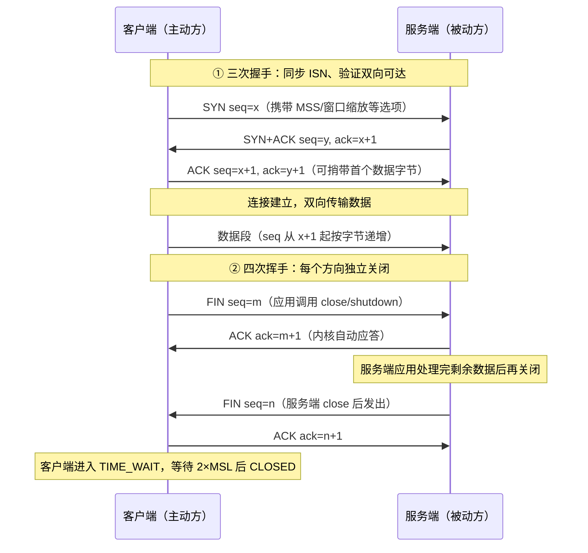

# TCP/IP 基础：三次握手与四次挥手

## 定义

TCP（Transmission Control Protocol，见 RFC 9293）是 TCP/IP 体系里传输层的“面向连接、可靠、全双工、按字节流有序交付”协议。**三次握手**（three-way handshake）指正式传数据之前，客户端与服务端通过交换 **SYN → SYN+ACK → ACK** 三个报文段建立连接；**四次挥手**（connection teardown）指连接关闭阶段双方各自独立关闭自己的发送方向，表现为 **FIN → ACK → FIN → ACK** 四段交互。

它解决的问题有三类：其一，在只提供“尽力而为”投递的 IP 网络之上，建立一条逻辑上可靠、可确认、可重传、可排序的虚拟信道；其二，建连时必须同步双方的初始序列号（ISN），并核实“我能收你、你能收我”的双向可达性，同时防止网络中滞留的旧报文串入新连接；其三，全双工信道下两个方向的数据通道要能**分别关闭**——一方关发送，不代表另一方必须立即停发。

核心特征：TCP 是**有状态**协议，连接的每一端都运行着包含 ESTABLISHED、FIN_WAIT_1、CLOSE_WAIT、TIME_WAIT 等状态的有限状态机（共 11 态）；它是**面向字节流**而非面向报文的，序号按字节编号。适用范畴：HTTP/HTTPS、SSH、SMTP、数据库、文件传输等对可靠性、按序性敏感的应用；而可容忍少量丢包的实时音视频、DNS 查询、局域网广播等场景，UDP 更合适。

## 原理

TCP 头中与握手/挥手直接相关的字段有：源端口与目的端口（各 16 bit）、序号 seq 与确认号 ack（各 32 bit）、标志位（SYN、ACK、FIN、RST 等）、窗口大小、校验和，以及选项区协商的 MSS、窗口缩放因子、SACK、时间戳。握手/挥手的控制报文本身不携带应用数据（第三个握手 ACK 允许捎带首包数据），但 **SYN 与 FIN 各消耗一个序号**，所以对端的确认号总是“对方的起始序号 + 1”，语义是“期待下一个字节”。

### 为什么恰好是三次握手

设计目标是同步双方的 ISN 并让**服务端**确信客户端确实收到了自己的 SYN+ACK。设客户端 ISN 为 $x$、服务端 ISN 为 $y$：

$$C \to S:\ SYN(seq=x) \qquad \Rightarrow \qquad S \to C:\ SYN+ACK(seq=y,\ ack=x+1) \qquad \Rightarrow \qquad C \to S:\ ACK(seq=x+1,\ ack=y+1)$$

- 第 1 段 SYN：客户端宣布“我要建连，我的起始字节号是 $x$”；
- 第 2 段 SYN+ACK：服务端用 $ack=x+1$ 确认收到客户端的 SYN，同时宣告自己的起始字节号 $y$——客户端据此确认“服务端能收也能发”；
- 第 3 段 ACK：客户端用 $ack=y+1$ 确认服务端的 ISN——服务端据此确认“客户端收到了我的 SYN+ACK”，至此双向收发能力都被验证，连接进入 ESTABLISHED。

为什么不能是两次：若服务端收到 SYN 即回 SYN+ACK 并直接建连，那么一个在网络中滞留很久的旧 SYN 副本到达时，服务端会白分配资源并进入“无主”的 ESTABLISHED（半开连接）；且当该 SYN+ACK 丢失时，两端对“连接是否存在”的判断会不一致。第三次 ACK 正是让服务端验证自己发出的 SYN+ACK 是否真正到达客户端的机制，这也是 RFC 793 采用三次握手的核心理由。报文成本恒为 3 段、耗时 1 个 RTT，开销为 $O(1)$。



### 为什么关闭需要四次

TCP 是全双工的：连接由“客户端→服务端”和“服务端→客户端”两条单向信道组成，必须**分别关闭**，而每次单向关闭都是“发 FIN → 对方回 ACK”的两段式，故标准流程为四次。第 2 步的 ACK 由内核收到 FIN 时立即回复，**不代表服务端应用同意关闭**——它可能还有数据要发；应用调用 `close()` 或 `shutdown(SHUT_WR)` 后，本端才发送自己的 FIN。

状态迁移（设客户端为主动关闭方）：客户端 ESTABLISHED → FIN_WAIT_1（已发 FIN）→ FIN_WAIT_2（收到对端 ACK）→ TIME_WAIT（收到对端 FIN 并回 ACK）→ CLOSED；服务端 ESTABLISHED → CLOSE_WAIT（收到 FIN，通知应用 close）→ LAST_ACK（应用已 close、发出自己的 FIN）→ CLOSED（收到客户端最后的 ACK）。

主动关闭方必须停留 TIME_WAIT，等待时长固定为两倍报文最大生存时间：

$$T_{TIME\_WAIT} = 2 \times MSL$$

目的有二：一是最后的 ACK 可能丢失，对端会重传 FIN，TIME_WAIT 期间可重发 ACK 兜底；二是保证本连接残留在网络中的旧报文段在 2×MSL 内彻底消亡，避免四元组（源 IP、源端口、目的 IP、目的端口）被新连接复用时把上一个连接的旧数据错投进来。补充：若服务端收到 FIN 时恰好无剩余数据且立即 close，第 2、3 步的 ACK 与 FIN 可合并进同一个报文，线上表现为 3 个报文——语义上仍是“两个方向各一对 FIN/ACK”，标准教材按 4 段描述。

## 应用

典型场景：HTTP(S)、数据库、SSH、SMTP 等所有可靠传输都跑在 TCP 连接上；反向代理/负载均衡（nginx、HAProxy）会与客户端、上游各自建立一条 TCP 连接，是观察握手最频繁的中间件；连接池（HTTP keep-alive、数据库连接池）通过复用已建连接来避免反复握手挥手的开销与 TIME_WAIT 堆积。

排查快速上手：① 看状态——Linux 下 `ss -tan` 或 `netstat -ant` 列出连接与状态，重点抓 TIME_WAIT / CLOSE_WAIT / SYN_SENT 三类异常；② 抓包——Wireshark 过滤 `tcp.flags.syn == 1` 或 `tcp.flags.fin == 1` 可直接看到握手/挥手报文及其 seq/ack；③ 定位角色——TIME_WAIT 只出现在主动关闭方，先判断谁是主动方，再确认关闭卡在哪一个状态、缺了哪一段报文。

常见坑：① **CLOSE_WAIT 堆积**：服务端收到 FIN 后应用没有 close()（典型是异常分支漏关 socket），连接卡在 CLOSE_WAIT 直至文件描述符耗尽；② **TIME_WAIT 过多**：短连接密集的客户端会在 2×MSL 内积压大量 TIME_WAIT，耗尽本地端口，应改用连接复用；服务端重启可用 SO_REUSEADDR，谨慎使用内核 `tcp_tw_reuse`（`tcp_tw_recycle` 已废弃且 NAT 后有害）；③ **向已关闭连接写数据**：对端 FIN 之后再 send 会收到 RST，Python 中表现为 `ConnectionResetError`/`BrokenPipeError`；④ SYN Flood：攻击者只发 SYN 不回 ACK 占满半连接队列，靠 `syncookies` 与 backlog 调优缓解；⑤ 空闲长连接常被运营商/NAT 设备静默回收，需要 TCP keep-alive 或应用层心跳保活。

```python
# tcp_handshake_wave_demo.py —— 在应用层"观察"三次握手与四次挥手
# 关键事实：socket API 看不到 SYN/FIN 报文本身，只能看到其后果——
#   connect() 返回            == 三次握手完成
#   recv() 返回 b""           == 收到对端 FIN（对端已关闭其发送方向）
# 服务端运行在线程中，单机即可运行本示例。
import socket
import threading
import time


def run_server(port_box, ready):
    srv = socket.socket(socket.AF_INET, socket.SOCK_STREAM)
    srv.setsockopt(socket.SOL_SOCKET, socket.SO_REUSEADDR, 1)  # 便于 TIME_WAIT 期间快速重启
    srv.bind(("127.0.0.1", 0))          # 端口 0：由操作系统分配空闲端口
    srv.listen(5)                        # listen 后内核才开始应答 SYN（握手先于 accept 完成）
    port_box.append(srv.getsockname()[1])
    ready.set()                          # 通知主线程端口已就绪

    conn, addr = srv.accept()            # 阻塞至三次握手完成才返回
    print(f"[server] accept 返回，三次握手完成，对端 {addr}")

    while True:
        data = conn.recv(4096)
        if not data:                     # b'' == 收到客户端 FIN（挥手第 1 步）
            print("[server] 收到 FIN，进入 CLOSE_WAIT（第 2 步 ACK 由内核自动回复）")
            break
        conn.sendall(data)               # 回显应用数据

    time.sleep(0.2)                      # 模拟"还有数据要处理"
    conn.sendall(b"bye from server")     # CLOSE_WAIT 期间仍可发送：体现半关闭语义
    conn.close()                         # close 触发发送 FIN（挥手第 3 步），进入 LAST_ACK
    print("[server] close()，已发送 FIN")
    srv.close()


def run_client(port):
    cli = socket.create_connection(("127.0.0.1", port))  # 阻塞至三次握手完成
    print("[client] connect 返回，三次握手完成，进入 ESTABLISHED")
    cli.sendall(b"ping")
    cli.shutdown(socket.SHUT_WR)         # 半关闭：只关发送方向 → 发送 FIN（挥手第 1 步）
    print("[client] shutdown(SHUT_WR)，已发 FIN：FIN_WAIT_1 -> FIN_WAIT_2")

    buf = b""
    while True:
        chunk = cli.recv(4096)
        if not chunk:                    # b'' == 收到服务端 FIN（挥手第 3 步）
            print("[client] 收到服务端 FIN 并回 ACK，进入 TIME_WAIT（2×MSL）")
            break
        buf += chunk
    print("[client] 完整接收:", buf.decode())
    cli.close()


if __name__ == "__main__":
    port_box, ready = [], threading.Event()
    threading.Thread(target=run_server, args=(port_box, ready), daemon=True).start()
    ready.wait()                         # 等待服务端把监听端口写入 port_box
    run_client(port_box[0])
```

**案例详解**：运行后典型输出顺序如下——服务端 `accept 返回` 与客户端 `connect 返回`：三次握手完成（SYN / SYN+ACK / ACK 三报文交换，socket API 只暴露“握手结束”这一结果）；客户端 `shutdown(SHUT_WR)` 打印：发出挥手第 1 个 FIN，进入 FIN_WAIT_1；服务端 `收到 FIN` 打印：第 2 段 ACK 由内核自动回复（不需要应用写代码），服务端进入 CLOSE_WAIT；服务端随后在 CLOSE_WAIT 阶段仍能 `sendall(b"bye from server")`，这正是 TCP 半关闭语义——收到对方 FIN 只代表“对方不再发送”，不代表“本端不能发送”；服务端 `close()` 发出第 3 个 FIN 进入 LAST_ACK；客户端 `recv()` 依次收到回显数据与道别数据后读到 `b''`，说明收到第 3 个 FIN 并回第 4 个 ACK，随后进入 TIME_WAIT 等待 2×MSL。若用 Wireshark 抓 loopback 口，可观察到 seq/ack 逐字节递增、SYN 与 FIN 各占一个序号号。务必记住：应用层只能看到 `recv()==b''` 这类间接信号，验证真实报文时序要靠抓包或 `ss -tan` 状态观测。

---
## 关联
- 前置：无（本笔记为 09 板块网络主题的基础起点，可直接阅读）
- 类似：[[IO模型-note]]（区别是：本文解决"连接如何建立/关闭"的报文时序与状态迁移，IO 模型解决"已建立连接上的数据读写如何调度/是否阻塞"）
- 进阶：[[HTTP与HTTPS-note]]（HTTP 报文作为载荷跑在 TCP 连接之上，可对照 HTTP 层与 TCP 层各自的连接语义与生命周期）

---
## 对比选型
| 方案 | 核心思想 | 最佳场景 |
|------|---------|----------|
| 本文方案：TCP 三次握手 + 四次挥手 | 面向连接、可靠、全双工；以固定报文序同步 ISN、按方向独立关闭并留 TIME_WAIT 兜底 | HTTP(S)、SSH、数据库等要求可靠有序交付的应用传输 |
| 替代方案：UDP 无连接传输 | 无握手/挥手，不保证送达与顺序，头部开销最小 | 实时音视频、DNS、游戏帧同步等可容忍少量丢失的场景 |
| 替代方案：QUIC（RFC 9000，基于 UDP） | 0/1-RTT 握手、内建 TLS 1.3、连接迁移与多路复用，避免队头阻塞 | 移动弱网下的 HTTP/3、对首字节时延敏感的应用 |
| 替代方案：长连接复用（keep-alive/连接池） | 不在业务层反复建连/断连，复用已有 TCP 连接以减少握手次数与 TIME_WAIT | 请求密集的客户端-服务端交互（浏览器、服务连接池） |

---
## 参考
- [RFC 9293: Transmission Control Protocol (TCP) — IETF](https://www.rfc-editor.org/rfc/rfc9293.html)
- [RFC 793: Transmission Control Protocol（三次握手与状态机的原始定义）— IETF](https://www.rfc-editor.org/rfc/rfc793.html)
- [RFC 9000: QUIC: A UDP-Based Multiplexed and Secure Transport — IETF](https://www.rfc-editor.org/rfc/rfc9000.html)

---
## 具体案例
- [[TCP/IP 基础：三次握手与四次挥手 实战示例]](TCP_IP基础_sample.py)
