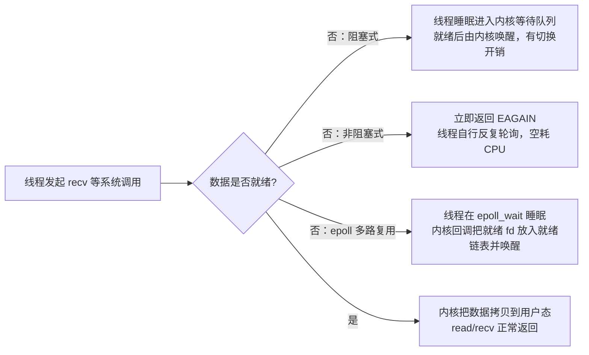

# IO 模型与多路复用（阻塞/非阻塞/select/epoll/asyncio）

## 定义

I/O 模型回答一个核心问题：**当进程发起 `read`/`write`/`accept` 而数据尚未就绪（数据包未到、缓冲区为空、磁盘未读完）时，调用方怎么办——由谁等待、等待期间 CPU 归谁**。按"调用方是否挂起"可分为**阻塞 I/O（BIO）**与**非阻塞 I/O（NIO）**；按"等待与数据拷贝由谁完成"可分为**同步 I/O**与**异步 I/O**，这两对概念相互正交（例如非阻塞 I/O 仍然是同步 I/O）。

**I/O 多路复用（multiplexing）**是同步模型下解决高并发的关键机制：单个线程把大量 socket 的"读/写/异常就绪"监听一次性委托给内核（`select`/`poll`/`epoll`），自己在一次系统调用上睡眠，内核发现有 fd 就绪才返回，线程再对就绪的 fd 做非阻塞读写。它把**并发连接数与线程/进程数解耦**，是解决 C10K（单机万级并发连接）的标准思路，Nginx、Redis、Netty 的底层均建立在其上。

**asyncio** 是 Python 对这一整套机制的库级封装：**事件循环（event loop）**驱动**协程（coroutine）**，单线程内通过 `await` 协作式切换任务——等待 I/O 时当前协程挂起，事件循环转去执行其他协程。核心特征：① 等待发生在内核而不是用户态忙轮询；② 就绪才读写，无空转；③ 单线程支撑海量并发连接。适用范畴：连接数多、单次数据量小、以"等待"为主的网络服务（网关/代理/IM/推送）；不擅长 CPU 密集型任务（会阻塞事件循环）。

## 原理

**为什么必须"由内核来等"**：应用无法预知数据何时到达，唯一可靠的信号源是内核（TCP 收包入缓冲、发送缓冲腾空都发生在内核态）。阻塞模型把线程挂到内核等待队列、就绪后唤醒，代价是每次都要线程上下文切换；非阻塞模型让系统调用立即返回 `EAGAIN/EWOULDBLOCK`，线程不挂起但必须反复自问（忙轮询，空耗 CPU）。多路复用取折中：把"逐个问"变成"内核替你盯住全部"，线程只在一处睡眠。

**select/poll 的代价**：每次调用都把整个 fd 集合从用户态拷入内核、全量扫描后再拷回，且 select 返回的是被改写的就绪集合，每轮循环必须重建监听集合。时间复杂度与**注册总数**成正比：

$$
T_{select/poll}(n)=O(n)\quad(\text{每轮全量扫描 + 两次用户态↔内核态拷贝；}n=\text{注册 fd 总数})
$$

select 还有硬上限 `FD_SETSIZE`（通常 1024）与"只返回就绪集合、还需二次遍历定位具体 fd"的低效；poll 用数组去掉 1024 上限，但仍是每轮全量扫描的 O(n) 模型。

**epoll 的改进（核心机制）**：`epoll_ctl` 把 fd **注册一次**（内核为每个 fd 挂上事件回调），此后数据到达时回调直接把该 fd 塞进内核维护的**就绪链表**，`epoll_wait` 只需把就绪链表拷给用户态——无需每轮重注册、无需扫描全量 fd：

$$
T_{epoll\_wait}(n)=O(r)\quad(r=\text{就绪 fd 数，与注册总数 }n\text{ 无关，可支撑十万级连接})
$$

触发方式两种：**水平触发 LT**（只要还有数据可读就持续通知，epoll 默认）与**边缘触发 ET**（状态变化只通知一次，之后必须把数据读到返回 `EAGAIN` 为止，否则漏数据）。注意 epoll 仍是**同步 I/O**——它只负责"告诉你就绪"，读写仍由应用线程完成；真正的异步 I/O（读写全程交给内核）是 Linux AIO/io_uring、Windows IOCP。

**asyncio 的事件循环调度**：底层把 selector（Linux 默认 epoll，Windows 3.8+ 默认 Proactor/IOCP）封装成 `loop.add_reader`/`add_writer` 回调；`await` 一个 I/O 时，协程把恢复点登记给事件循环后挂起，事件循环转去运行就绪队列中的其他协程；fd 就绪回调再把挂起的协程放回就绪队列。单线程 + 协作式调度 → 无锁、无线程切换开销，**并发总量受 fd 数而非线程数限制**。



## 应用

**典型场景**：高并发长连接服务（IM、消息推送、WebSocket 网关、反向代理）；需要同时监听海量 socket 的框架底层（Nginx/Redis/Netty/Tornado）；Python 侧的 aiohttp、FastAPI/uvicorn（可配 uvloop）均以 epoll + 事件循环为地基。

**快速上手步骤**：① 把 socket 设为非阻塞（`setblocking(False)`）；② 用 `selectors` 或原生 `epoll` 注册关心的事件（读/写/错误）并绑定回调；③ 主循环调用 `selector.select()` 睡眠等待就绪事件；④ 就绪后做非阻塞读写——`recv` 返回 `b""` 说明对端关闭（需注销并 close），抛 `BlockingIOError`（即 `EAGAIN`）说明本次无更多数据；⑤ 若使用 ET 触发，必须循环读到 `EAGAIN` 为止；⑥ 工程落地优先直接用 asyncio，而非手写事件循环。

**常见坑**：把阻塞 fd 注册进 epoll，一个慢连接会卡死整个事件循环；注册后忘记注销造成 fd 泄漏；ET 模式只读一次就停止会漏数据；在事件回调或协程里做耗时计算、调用 `time.sleep()` 会阻塞事件循环（应改用 `await asyncio.sleep()`，CPU 密集任务丢线程池 `loop.run_in_executor`）；跨平台差异——Windows 上 select 只支持 socket 且有 512 默认上限，`selectors.DefaultSelector` 在 Linux/macOS/Windows 分别落到 epoll/kqueue/select，行为与性能不同。

```python
"""三种 I/O 等待方式对照（可直接运行：底部 asyncio 自测会打印回显）"""
import socket
import selectors
import asyncio

# ---------- 模型一：阻塞 I/O ----------
def blocking_server():
    """每个连接占一个线程：线程数≈连接数，万级连接直接不可行"""
    srv = socket.socket()
    srv.bind(("127.0.0.1", 9001)); srv.listen(512)
    while True:
        conn, _ = srv.accept()      # 无新连接时线程挂起
        while True:
            data = conn.recv(1024)  # 对端不发数据时线程继续挂起
            if not data:
                break
            conn.sendall(data)      # 发送缓冲满时同样挂起
        conn.close()
# ---------- 模型二：select/epoll 多路复用（selectors 统一封装） ----------
sel = selectors.DefaultSelector()   # Linux→epoll, macOS→kqueue, Windows→select

def _on_read(conn, mask):
    data = conn.recv(1024)          # 就绪才读，此时不会阻塞
    if data:
        conn.sendall(data)          # 原样回显
    else:
        sel.unregister(conn)        # 对端关闭：注销并回收 fd
        conn.close()

def _on_accept(srv, mask):
    conn, _ = srv.accept()
    conn.setblocking(False)         # 注册前必须非阻塞，否则一次慢读会卡死循环
    sel.register(conn, selectors.EVENT_READ, _on_read)

def multiplexing_server():
    srv = socket.socket()
    srv.setsockopt(socket.SOL_SOCKET, socket.SO_REUSEADDR, 1)
    srv.bind(("127.0.0.1", 9002)); srv.listen(512)
    srv.setblocking(False)
    sel.register(srv, selectors.EVENT_READ, _on_accept)
    while True:
        for key, mask in sel.select():   # 单线程在这里睡眠，等“有 fd 就绪”才返回
            key.data(key.fileobj, mask)  # 按注册时绑定的回调分发 → 事件驱动

# ---------- 模型三：asyncio（事件循环 + 协程，封装上面整套机制） ----------
async def echo(reader, writer):
    while data := await reader.read(1024):  # 等数据=挂起协程让出事件循环，不占线程
        writer.write(data)
        await writer.drain()                # 背压：等发送缓冲腾空，同样让出 CPU
    writer.close()

async def demo():
    # 自测：启动一个回显服务端，再以客户端身份连一次
    srv = await asyncio.start_server(echo, "127.0.0.1", 8888)
    reader, writer = await asyncio.open_connection("127.0.0.1", 8888)
    writer.write(b"hello, IO model")
    await writer.drain()
    print("回显:", (await reader.read(1024)).decode())
    writer.close()
    await writer.wait_closed()
    srv.close()
    await srv.wait_closed()

asyncio.run(demo())
```

**案例详解**：模型一展示阻塞语义——`accept`/`recv`/`sendall` 任一环节数据未就绪，线程便睡眠挂起，连接数上升则线程数线性上升（每线程默认栈 ~8MB 虚拟内存），这是 C10K 问题的根源。模型二中 `DefaultSelector` 在 Linux 上就是 epoll：socket 注册一次，此后内核回调通知就绪 fd；`select()` 返回的每个 `key` 携带注册时绑定的回调（`key.data`）与事件掩码（`mask`），单线程即可服务海量连接。运行模型三（把本文件存为脚本执行）输出 `回显: hello, IO model`：整段代码看不到任何 `select()` 或回调，`await reader.read()` 在数据未到时挂起当前协程并把控制权交还事件循环，事件循环转去执行其他协程——这就是"单线程内协作式并发"。若把 demo 中的单次收发换成 `asyncio.gather` 并发发起数千次请求，可直观验证单线程高并发。

---
## 关联
- 前置：[[进程线程与协程-note]]（I/O 等待发生在线程/进程上，阻塞-唤醒的上下文切换开销正是多路复用要省掉的成本）
- 类似：[[GIL与Python并发-note]]（区别是：I/O 模型决定"连接如何等待数据"，GIL 决定"CPython 线程能否并行执行字节码"；两者叠加解释了为何 Python 高并发首选 asyncio 而非多线程）
- 进阶：[[TCP与IP基础-note]]（多路复用中"读就绪/可写"的语义由 TCP 收发缓冲区与滑动窗口定义，可向网络协议层继续深入）
- Python 侧（01 板块）：[[生成器和迭代器-note]]（async/await 由生成器协程（yield）演化而来，先理解挂起/恢复才能理解 await）；[[python上下文管理-note]]（asyncio 中常用 `async with` 管理连接与资源清理）

---
## 对比选型
| 方案 | 核心思想 | 最佳场景 |
|------|---------|----------|
| 本文方案：epoll 多路复用 + asyncio | 注册一次 fd，内核回调把就绪 fd 放入就绪链表，单线程事件循环驱动协程 | 高并发网络服务、海量长连接；Python 侧首选 asyncio/aiohttp |
| 阻塞 I/O + 线程池 | 每连接一线程，代码直观、无回调 | 连接数少（<数百）、逻辑简单、对吞吐要求不高的内部服务 |
| select/poll（传统多路复用） | 每次调用全量扫描 fd 集合并拷贝 | 跨平台、小规模（数千以内）兼容性优先的遗留系统 |
| io_uring / AIO（真异步） | 内核异步完成读写，"等待+拷贝"全部交给内核 | Linux 高版本内核、追求极限吞吐的存储/网络中间件 |

---
## 参考
- [epoll(7) — Linux manual page（man7.org）](https://man7.org/linux/man-pages/man7/epoll.7.html)
- [select(2) / poll(2) — Linux manual pages（man7.org）](https://man7.org/linux/man-pages/man2/select.2.html)
- [asyncio — Python 官方文档](https://docs.python.org/3/library/asyncio.html)
- [The C10K problem — Dan Kegel](http://www.kegel.com/c10k.html)

---
## 具体案例
- [[IO 模型与多路复用（阻塞/非阻塞/select/epoll/asyncio） 实战示例]](IO 模型与多路复用_sample.py)
