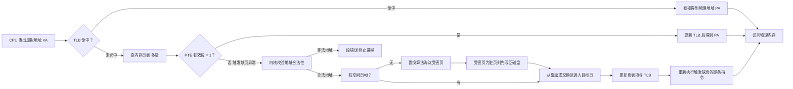

# 内存管理：虚拟内存与分页

## 定义
- **虚拟内存（virtual memory）** 是操作系统与硬件（MMU）协同提供的一种**地址空间抽象**：每个进程都"看到"一个从 0 到 $2^n-1$ 的连续逻辑地址空间，无论物理内存有多大、进程实际需要多少。
- 它要解决的问题源于早期内存管理（进程整体连续装入物理内存）：① 物理内存装不下大程序；② 连续分配产生外部碎片、固定分区产生内部碎片；③ 多进程之间缺乏隔离与保护；④ 进程空闲代码/数据白白占着内存，利用率低。
- **分页（paging）** 是虚拟内存最常见的实现机制：把虚拟地址空间切成**固定大小**的页（典型 4 KiB），物理内存切成等大的**页帧（frame）**，用**页表**记录"虚拟页 → 物理帧"的映射；页不必全部驻留，访问到哪一页才把哪一页调入——**按需调页（demand paging）**。
- 核心特征：逻辑地址与物理地址解耦；离散装入消除外部碎片；按需调入与淘汰让内存"超额使用"；进程间地址空间天然隔离；只读代码段与共享库可被多进程共享。
- 适用范畴：现代操作系统（Linux/Windows/macOS）内存管理的基石；其思想（局部性、页式缓存、LRU/时钟置换）同样辐射 CPU TLB、数据库缓冲池、文件页缓存与容器内存隔离等系统设计。

## 原理
为什么要这样设计？因为程序运行遵循**局部性原理**：任意短时间段内只密集访问少量页面（时间局部性：循环与栈；空间局部性：顺序取指令、遍历数组）。既然驻留全部页面纯属浪费，就让"物理内存 = 最近活跃页的缓存"，配合硬件翻译实现"内存看着很大、用着很省"。

虚拟地址到物理地址的翻译由 MMU + 页表完成（页大小 $P$）：

$$VPN = \lfloor VA / P \rfloor,\qquad offset = VA \bmod P,\qquad PA = frame \times P + offset$$

其中低 $\log_2 P$ 位是页内偏移，其余高位是虚拟页号 VPN。页表项（PTE）除物理帧号外还有关键状态位：**有效位/驻留位**（该页是否在内存）、**脏位**（写回磁盘时才需要）、**访问位**（供置换算法参考）、**保护位**（rwx 权限）。



关键机制与推导：
- **缺页流程**：访问未驻留页 → CPU 陷入缺页异常（page fault）→ 内核校验地址合法后分配/置换页帧 → 磁盘 I/O 调入 → 更新 PTE/TLB → 重新执行指令。一次缺页的代价是毫秒级磁盘 I/O，而一次 TLB 命中快至纳秒级，命中率因此决定性能。
- **页表为什么必须多级**：48 位虚拟地址 + 4 KiB 页 + 8 字节 PTE，单级页表需 $2^{48}/2^{12}=2^{36}$ 项，即每进程 512 GiB——不可行。多级页表只给"实际用到的页目录"分配内存，x86-64 用 4 级页表，代价是最坏需 4 次额外访存（由 TLB 掩盖）。
- **TLB**：页表翻译的快速缓存，容量 $C_{TLB}=N_{TLB}\times P$，例如 64 项 × 4 KiB = 256 KiB 覆盖。大页（2 MiB/1 GiB）通过放大 $P$ 提升覆盖并减少页表层级，代价是内部碎片与更粗的换页粒度。
- **置换算法与复杂度**：FIFO 入队 O(1)/次，但有 **Belady 异常**（增帧反而缺页更多）；LRU 精确实现是哈希表 + 双向链表、每次引用 O(1)，但硬件无法低成本记录精确访问时间，故用 **时钟/二次机会算法** 近似——访问位循环扫描，摊销 O(1)/次（单次扫描最坏 O(帧数)）。当工作集超过可用帧数时发生**抖动（thrashing）**，系统忙于换页而 CPU 空转，需靠工作集模型或局部置换抑制。
- **写时复制（COW）**：fork 时父子共享只读页，任一方向首次写才复制，把"复制整个地址空间"摊到"被写到的页"，配合 vfork/mmap 大幅降低进程创建开销。

## 应用
- **典型场景**：运行总内存需求超过物理内存的负载（内存超额销售/overcommit）；`fork()` 写时复制；`mmap` 映射共享库、大文件或做零拷贝 I/O；数据库缓冲池用同一套"页 + LRU/时钟"思想管理磁盘页；JVM/大缓存服务开启 HugePages 提升 TLB 命中率。
- **快速上手排查（Linux）**：① `free -h` 看物理内存与 swap 水位；② `vmstat 1` 观察 `si/so`（换入换出页）与 `pgfault`，`si/so` 持续非零即换页活跃；③ `cat /proc/<pid>/status | grep -E "VmRSS|VmSwap"` 定位进程真实驻留/换出量；④ `sar -B` 或 `perf` 统计缺页与 page fault 热点；⑤ 对症处理：收紧缓存、限制并发、改用内存映射、分配更大物理内存。
- **快速上手实验（本机）**：写一个遍历大数组的程序，对比顺序访问与随机访问（见下方代码），随机版缺页数高出两三个数量级——这是理解"为什么局部性是虚拟内存的根基"最直观的验证。
- **注意事项/常见坑**：① 别把"虚拟内存大"当"物理可用"，malloc 成功不代表内存够用，overcommit 下过量分配会触发 OOM killer；② 抖动 ≠ 正常换页，特征是 si/so 高而 %us 低；③ mmap 修改文件后需 `msync` 才保证落盘；④ fork 后大数组被逐页触碰会触发大量 COW 缺页；⑤ 滥用 HugePages 会因不可换出挤占普通页并加剧碎片；⑥ Python 侧用 `tracemalloc` 统计的是解释器堆对象，与进程 RSS/页表指标不是一回事。

```python
"""虚拟内存与分页核心机制模拟：地址拆分 + 按需调页的 FIFO/LRU 置换。"""
import random

PAGE_SIZE = 4096   # 页大小 4 KiB（与主流 OS 一致）
FRAMES = 3         # 物理页帧数（演示用小值）

def split_address(va):
    """把虚拟地址拆成虚拟页号 VPN 与页内偏移 offset。"""
    vpn = va // PAGE_SIZE
    offset = va % PAGE_SIZE
    return vpn, offset

def page_faults(reference, frames, lru=True):
    """沿引用串模拟按需调页，返回缺页次数。
    resident[0] 是队首：FIFO 指最早装入，LRU 指最久未被访问。"""
    resident = []   # 当前驻留页帧
    faults = 0
    for page in reference:
        if page in resident:            # 命中
            if lru:                     # LRU：把本次访问的页提到"最新"
                resident.remove(page)
                resident.append(page)
        else:                           # 缺页：调入并淘汰队首
            faults += 1
            if len(resident) == frames:
                resident.pop(0)
            resident.append(page)
    return faults

if __name__ == "__main__":
    # Silberschatz《操作系统概念》经典引用串（3 帧下 FIFO=15、LRU=12、最优=9）
    ref = [7, 0, 1, 2, 0, 3, 0, 4, 2, 3, 0, 3, 2, 1, 2, 0, 1, 7, 0, 1]
    print("缺页次数 FIFO =", page_faults(ref, FRAMES, lru=False))
    print("缺页次数 LRU  =", page_faults(ref, FRAMES, lru=True))
    print("缺页次数 OPT  = 9（最优置换，理论下界）")

    # 地址翻译示例：一条指令地址 0x80483A2A
    va = 0x8048_3A2A
    vpn, offset = split_address(va)
    print(f"VA={va:#010x} -> VPN=0x{vpn:x}, offset=0x{offset:x} (低 12 位)")

    # 局部性验证：同一页帧数下，顺序循环 vs 随机跳转的缺页差异
    rng = random.Random(42)
    seq = [i % 64 for _ in range(20000)]                # 只在 64 页内循环
    rnd = [rng.randrange(4096) for _ in range(20000)]   # 摊到 4096 页
    print("顺序访问缺页 =", page_faults(seq, 128, lru=True),
          "| 随机访问缺页 =", page_faults(rnd, 128, lru=True))
```

**案例详解**：① 教材引用串在 3 帧下 FIFO 缺页 15 次、LRU 仅 12 次（理论最优 9 次）——LRU 淘汰"最久未用"的页，保住了近期活跃的 0/1 页，这正是按访问历史预测未来的启发式；② 地址拆分把 `0x80483A2A` 变为 VPN=`0x80483`（高位 20 位）+ offset=`0xA2A`（低 12 位），物理地址 = 帧号 × 4096 + 0xA2A，可见页内偏移在翻译中"直通不变"；③ 局部性对比是结论性实验：帧数同为 128 时，顺序循环仅缺页 64 次（每页首次装入一次后常驻），随机访问约缺页 4000+ 次（几乎每次碰到新页都要换入）——两者差两个数量级，而总访问次数相同，证明**缺页次数由访问页的广度（工作集）决定而非访问总量**，也解释了随机遍历大数组、缓存未命中为何灾难性变慢。

---
## 关联
- 前置：[[进程线程与协程-note]]——虚拟内存以进程为单位分配独立地址空间，线程共享所属进程的地址空间，进程模型是理解页表隔离与内存布局的前提。
- 类似：[[索引原理与B+树-note]]——区别是 B+树 以"页"为单位组织磁盘数据并由数据库缓冲池做 LRU/时钟替换，思想与换页同构，但前者面向查询的磁盘缓存，后者面向 CPU 地址翻译与内存超额。
- 进阶：[[IO模型-note]]——mmap 与零拷贝把磁盘文件直接映射进进程地址空间，缺页即文件 I/O，虚拟内存与 I/O 在此汇合，是理解现代 I/O 路径的进阶视角。
- Python 生态：[[生成器和迭代器-note]]（惰性取值避免大列表一次性驻留内存，是应用层的"按需"思想）、[[python上下文管理-note]]（`with` 及时释放文件句柄与大缓冲区，降低进程 RSS）。

---
## 对比选型
| 方案 | 核心思想 | 最佳场景 |
|------|---------|----------|
| 本文方案：虚拟内存 + 分页 | 固定大小页离散映射，页表/MMU 翻译，按需调页 + 置换 | 通用 OS、强隔离、多进程内存超额，现代主流 |
| 分段 segmentation | 按代码/数据/栈等逻辑段连续映射，段表存 (基址, 界限)，天然支持按段共享与保护 | 程序结构清晰、按逻辑单元共享；缺点：外部碎片与段长管理复杂 |
| 连续分配 + 整体交换 | 进程整块装入物理内存，放不下就整体换出到磁盘 | 早期内存小、进程数少的简单系统 |
| 段页式 segmentation+paging | 先按逻辑分段、段内再分页，兼顾共享粒度和无碎片 | 需要"逻辑结构清晰 + 页式管理"的复杂内核/硬件（x86 传统模式等） |

---
## 参考
- [Operating Systems: Three Easy Pieces (OSTEP) — Paging: Introduction](https://pages.cs.wisc.edu/~remzi/OSTEP/vm-paging.pdf)
- [Operating Systems: Three Easy Pieces (OSTEP) — Beyond Physical Memory: Policies](https://pages.cs.wisc.edu/~remzi/OSTEP/vm-beyondphys-policy.pdf)
- [mmap(2) — Linux manual page（man7.org）](https://man7.org/linux/man-pages/man2/mmap.2.html)
- [Linux Kernel Documentation — pagemap：查看进程虚拟页映射与驻留位](https://www.kernel.org/doc/html/latest/admin-guide/mm/pagemap.html)
- [Silberschatz《Operating System Concepts》官方资源页](https://www.os-book.com/OS10/)

---
## 具体案例
- [[内存管理：虚拟内存与分页 实战示例]](内存管理：虚拟内存与分页_sample.py)
