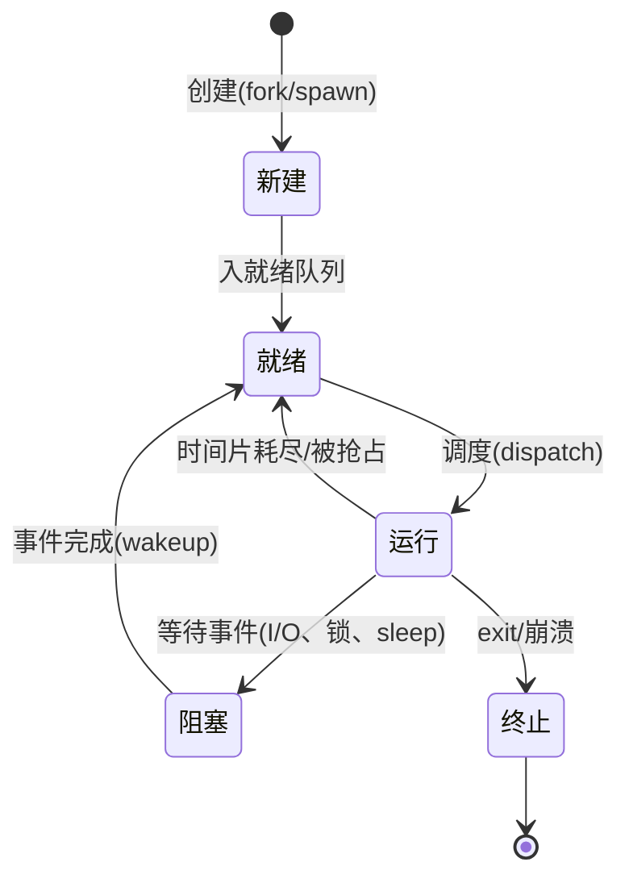
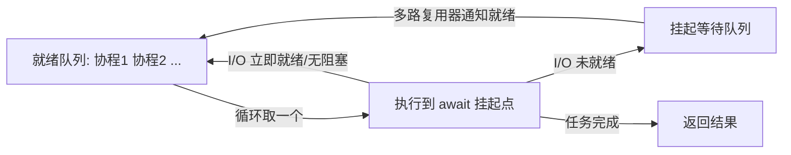

# 进程 / 线程 / 协程

## 定义

**进程（Process）**：操作系统进行**资源分配**的基本单位，是程序的一次执行实例。每个进程拥有独立的虚拟地址空间、文件描述符表、信号处理器、环境变量等资源，进程之间默认互相隔离，一个进程崩溃通常不影响其他进程。进程间协作必须借助 IPC（管道、消息队列、共享内存、Socket、信号等），代价较高。进程解决的核心问题：**隔离 + 并行 + 故障隔离**——多个程序互不干扰地在同一台机器上跑。

**线程（Thread）**：进程内部进行**CPU 调度**的基本单位，是"轻量级进程"。同一进程内的线程共享地址空间、堆、全局变量与打开的文件，各自只保留独立的栈、寄存器上下文与线程局部存储（TLS）。线程创建与切换不涉及页表切换与 TLB 冲刷，成本低于进程切换，但共享数据天然带来竞态（race condition），需要加锁同步。在 Linux 上线程本质是用 `clone()` 以共享地址空间标志创建的轻量进程（NPTL 的 1:1 线程模型）。线程解决的核心问题：**低成本并行 + 便捷共享**。

**协程（Coroutine）**：完全在**用户态**调度、由程序员（或运行时）显式控制切换顺序的子例程。协程切换不触发系统调用、不进入内核态，只需保存少量寄存器与栈帧，开销比线程切换低 1~2 个数量级。协程是**协作式**的：必须主动 `await`/`yield` 让出 CPU，否则不会被"抢占"。它解决的核心问题：**大规模 I/O 并发下线程数量爆炸与切换开销**——单线程事件循环可驱动数万协程。适用范畴：I/O 密集型高并发；CPU 密集型仍需多进程/多线程利用多核。

三者是"并发执行载体"由重到轻的三级抽象：进程重隔离、线程重共享、协程重轻量。

## 原理

**为什么分层设计？** CPU 核数有限，而任务（尤其 I/O 任务）大多在等待。内核把"执行权"切来切去来复用 CPU：切换对象越小、越接近用户态，成本越低。操作系统层面对每个执行实体维护一个控制块——进程用 PCB（task_struct）、线程用 TCB（在 Linux 中与进程同用 task_struct），记录寄存器、栈指针、调度状态；协程则完全由用户态运行时（事件循环/调度器）记录，内核无感知。

**进程五态状态机**（线程类似，只有 TCB 没有地址空间切换）：



**切换成本的数量级差异**（决定选型的关键依据）：

$$T_{process} \gg T_{thread} \approx 10^0\sim10^1\,\mu s \gg T_{coroutine} \approx 10^2\,ns$$

进程切换 = 保存/恢复寄存器 + **切换页表 + 冲刷 TLB** + 进出内核态；线程切换省去页表与 TLB 部分，但仍要进出内核态；协程切换只在用户态保存少量寄存器与栈帧，通常仅数百纳秒。多核并行收益遵循 **Amdahl 定律**：

$$S_{speedup} = \frac{1}{(1-P)+\frac{P}{N}}$$

其中 $P$ 为可并行部分占比、$N$ 为核数——串行部分（临界区、GIL）会封顶加速比。

**协程的运行机制**（以 Python asyncio 事件循环为例）：协程遇到 `await` 一个未就绪的 Future 时，把自身挂起到等待队列并让出控制权；I/O 就绪后（由 epoll/IOCP 多路复用器通知）回调把协程放回就绪队列；事件循环依次取出执行。宏观调度图如下：



**并发模型三种映射**：1:1（每个用户线程绑一个内核线程，如 Linux NPTL、Java 早期线程）；N:1（多个用户线程跑在一个内核线程上，即 green thread，调度灵活但无法并行）；N:M（m 个用户线程映射到 n 个内核线程，如 Go GMP、Java Loom 虚拟线程），是协程思想在语言运行时层面的工程化。

## 应用

**选型场景**：CPU 密集 → 用进程数 ≈ 核数（Python 中因 GIL 更要靠 `multiprocessing` 并行）；I/O 密集 + 超高并发 → 协程（单线程内跑数万连接，如网络爬虫、Web 网关、聊天服务）；I/O 密集 + 中低并发或需要阻塞式第三方库 → 线程池；需要强隔离/容错（子任务崩溃不影响主服务）→ 多进程。

**快速上手步骤（Python）**：① `threading.Thread(target=fn)` 或 `concurrent.futures.ThreadPoolExecutor`；② `multiprocessing.Process` + `Queue`/`Pool`（务必加 `if __name__ == "__main__":` 保护，Windows 下用 spawn 启动）；③ `async def` + `await`，入口统一 `asyncio.run(main())`，并发用 `asyncio.gather`/`create_task`。

**常见坑**：
- **协程里做阻塞调用**（`time.sleep`、同步 `requests`、`subprocess.run`）会卡死整个事件循环，必须换成 `asyncio.sleep`/`aiohttp`/`run_in_executor`；
- **协程里跑 CPU 密集代码**不会被抢占，阻塞其他协程，应丢进线程池执行；
- CPython 的 GIL 使多线程无法并行 CPU 任务，且线程数过多（Linux 默认 8MB 栈）会耗尽内存——高并发首选协程或进程；
- 忘了 `await`/忘了 `create_task`（协程对象不执行）是 asyncio 最高频 bug；
- 多线程共享可变状态不加锁 → 竞态；加锁顺序不一致 → 死锁；
- 协程栈默认较小且有深度限制，深层递归别放在协程里。

```python
"""同一批 I/O 型任务分别用 线程池 / 进程池 / 协程 并发执行，对比耗时与资源占用。

用 time.sleep 模拟一次阻塞式 I/O（如 HTTP 请求）；真实场景中应替换为
requests / aiohttp / 数据库客户端等，但模型对比结论一致。
"""
import asyncio
import time
from concurrent.futures import ProcessPoolExecutor, ThreadPoolExecutor

TASKS = 8       # 并发任务数
IO_TIME = 1.0   # 每个任务模拟的网络/磁盘等待秒数


def io_task(_: int) -> None:
    """线程/进程版任务：阻塞式 sleep 模拟同步 I/O 等待。"""
    time.sleep(IO_TIME)


async def io_task_async(_: int) -> None:
    """协程版任务：await 到挂起点即让出线程，不占用任何线程。"""
    await asyncio.sleep(IO_TIME)


def run_threads() -> float:
    t0 = time.perf_counter()
    with ThreadPoolExecutor(max_workers=TASKS) as pool:   # 8 个内核线程并行等待
        list(pool.map(io_task, range(TASKS)))
    return time.perf_counter() - t0


def run_processes() -> float:
    t0 = time.perf_counter()
    with ProcessPoolExecutor(max_workers=TASKS) as pool:  # 8 个独立进程
        list(pool.map(io_task, range(TASKS)))
    return time.perf_counter() - t0


def run_coroutines() -> float:
    t0 = time.perf_counter()
    asyncio.run(asyncio.gather(*(io_task_async(i) for i in range(TASKS))))
    return time.perf_counter() - t0


if __name__ == "__main__":   # Windows 下进程池 spawn 模式必需，否则递归报错
    print(f"线程池(8线程):  {run_threads():.2f}s")     # 约 1.0s
    print(f"进程池(8进程):  {run_processes():.2f}s")   # 约 1.0s + 进程创建开销
    print(f"协程(单线程):   {run_coroutines():.2f}s")  # 约 1.0s，全程只用 1 个线程
```

**案例详解**：8 个任务各自等待 1 秒。若串行执行需 8 秒；三种并发模型都让 8 个任务同时等待，因此都约 1 秒。差异在资源占用：线程池创建 8 个内核线程（每线程约 8MB 虚拟栈）；进程池派生 8 个独立解释器（内存最大、启动最慢，输出里进程池耗时通常略高于前两者）；协程方案只开 1 个线程 + 1 个事件循环，却承载了同样 8 路并发——把 TASKS 提到 10000，线程/进程方案内存直接爆炸或创建失败，协程仍可平稳运行。把协程任务的 `asyncio.sleep` 误写成 `time.sleep` 再跑，耗时会回到约 8 秒——这正是"阻塞调用卡死事件循环"坑的现场演示。

---
## 关联
- 前置：[[IO模型-note]]（阻塞/非阻塞与 I/O 多路复用是协程省线程的前提）、[[生成器和迭代器-note]]（Python 协程的前身与语法基石：yield 的暂停/恢复语义）
- 类似：[[GIL与Python并发-note]]（区别是：GIL 讲 CPython 里"线程无法并行 CPU 任务"的约束与绕过方案，本笔记讲三种执行载体本身的机制与成本）；[[python上下文管理-note]]（区别是：上下文管理负责资源生命周期，常与线程锁、连接池、`async with` 配套使用，不是并发载体本身）
- 进阶：[[内存管理-note]]（虚拟地址空间、栈与堆的分配方式，是多线程共享与进程隔离的底层依据）

---
## 对比选型
| 方案 | 核心思想 | 最佳场景 |
|------|---------|----------|
| 协程（本文重点） | 用户态协作式调度，`await` 让出、事件循环驱动 | 单机数万级 I/O 并发：爬虫、网关、聊天、API 服务 |
| 多线程 | 内核线程抢占式调度，共享地址空间 | 中低并发 I/O、需用阻塞库、GUI 后台任务 |
| 多进程 | 独立地址空间，真并行 + 强隔离 | CPU 密集型（含 CPython 避开 GIL）、需要故障隔离 |

**选型速查**：要"超高 I/O 并发 + 低开销"选协程；要"代码简单、不怕第三方阻塞库"选线程；要"吃满多核且可并行 CPU"选进程；隔离/稳定性要求高也选进程。

---
## 参考
- [Python threading — 基于线程的并行](https://docs.python.org/3/library/threading.html)
- [Python asyncio — 异步 I/O、事件循环与协程](https://docs.python.org/3/library/asyncio.html)
- [Operating Systems: Three Easy Pieces (OSTEP)，Concurrency 相关章节](https://pages.cs.wisc.edu/~remzi/OSTEP/)
- [pthreads(7) — Linux man page（线程模型与属性）](https://man7.org/linux/man-pages/man7/pthreads.7.html)

---
## 具体案例
- [[进程 / 线程 / 协程 实战示例]](进程 / 线程 / 协程_sample.py)
