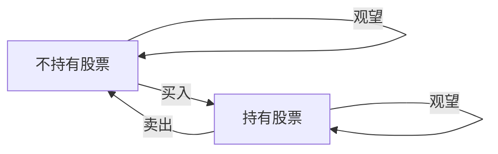

# 买卖股票的最佳时机 II（多次交易）

> **一句话总结**：  
> 可以无限次买卖，抓住所有上涨波段，累加每段正差价即得最大利润。

## 核心原理 / 流程

**核心思想**：既然不限交易次数，就把所有能赚钱的"上坡"都赚到。每天只要比前一天价格高，就视为前一天买入今天卖出，累加所有正差价。

**两种主流解法**：

### 解法一：贪心（累加正差价）

**口诀**：`后一天比前一天贵，今天就赚差价；一直跌就不交易。`

```python
class Solution:
    def maxProfit(self, prices: List[int]) -> int:
        profit = 0
        for i in range(1, len(prices)):
            if prices[i] > prices[i-1]:
                profit += prices[i] - prices[i-1]
        return profit
```

### 解法二：DP 状态机（通用框架）

**状态定义**：
- `hold`：持有股票的最大利润
- `not_hold`：不持有股票的最大利润

```python
class Solution:
    def maxProfit(self, prices: List[int]) -> int:
        hold = -float('inf')  # 初始不可能持有
        not_hold = 0           # 初始不持有，利润为0
        
        for p in prices:
            # 今天不持有 = max(昨天不持有, 昨天持有+今天卖出)
            not_hold = max(not_hold, hold + p)
            # 今天持有 = max(昨天持有, 昨天不持有-今天买入)
            hold = max(hold, not_hold - p)
            
        return not_hold
```

**Mermaid 状态转移图**：



## 易错点 / 坑

- ❌ 错误现象：试图模拟真实交易，纠结"哪天买入哪天卖出"，把问题复杂化。  
  ✅ 正确做法：贪心法将连续上涨拆分成每天买卖，数学上等价（如 `5-1 = (2-1)+(3-2)+(4-3)+(5-4)`）。

- ❌ 错误现象：贪心时写成 `if prices[i] > min_price: profit += prices[i] - min_price`，试图找波段的起点和终点。  
  ✅ 正确做法：直接累加相邻正差价，不需要维护 `min_price`，更简洁。

- ❌ 错误现象：DP 中 `hold` 和 `not_hold` 更新顺序写反，导致同一天多次买卖（允许但不必要，不会影响结果，但逻辑不清晰）。  
  ✅ 正确做法：先用旧状态计算新状态，或用临时变量保存。

## 提取练习

- Q1：贪心法为什么"每天买卖"是合法的？题目允许同一天多次买卖吗？  
  A1：合法。因为 `prices[i] - prices[i-1]` 的正差价累加，等价于在最低点买入、最高点卖出。题目允许同一天买卖，但实际执行时我们并不真的每天交易，只是数学拆分。

- Q2：如果价格序列是 `[1,2,3,4,5]`，贪心累加 `(2-1)+(3-2)+(4-3)+(5-4)=4`，和真实交易（第1天买第5天卖）利润一致，为什么？  
  A2：因为连续上涨的累计差价等于首尾差价：`(5-1) = (2-1)+(3-2)+(4-3)+(5-4)`，数学上等价。

- Q3：DP 解法中 `hold = max(hold, not_hold - p)` 为什么不是 `hold = max(hold, not_hold_old - p)`？  
  A3：因为 `not_hold` 在上一行已经被更新为今天的"不持有"状态，如果继续用更新后的 `not_hold`，相当于在"今天卖出后又买入"，允许同一天多次交易。虽然本题允许，但为了语义清晰，应该用旧值。更严谨的写法是保存旧变量。

## 关联

- 前置：[[121. 买卖股票的最佳时机（一次交易）]]
- 横向：[[123. 买卖股票的最佳时机 III（最多两笔）]]、[[188. 买卖股票的最佳时机 IV（最多K笔）]]
- 进阶：[[309. 最佳买卖股票时机含冷冻期]]、[[714. 买卖股票的最佳时机含手续费]]

---

## 对比与选型

| 方案 | 核心思想 | 时间复杂度 | 空间复杂度 | 最佳场景 |
|------|---------|-----------|-----------|----------|
| 贪心（累加正差价） | 所有上涨都赚 | O(n) | O(1) | **最简洁、最优** |
| DP 状态机 | 持有/不持有转移 | O(n) | O(1) | 统一框架，便于扩展 |
| 递归+记忆化 | 每天决策买/卖/等 | O(n²) | O(n) | 仅用于理解，不实用 |

**选型速查**：要 **最简洁的代码** 选贪心；要 **统一扩展到K笔交易** 选 DP。

## 贪心法的直观证明（可选）

**为什么累加所有正差价一定最优？**

把价格画成折线图，任何一次完整的"买入→持有→卖出"的利润 = 卖出价 - 买入价。如果中间有波动，拆成多段交易可以捕捉到所有上涨部分：

```
价格: 1 → 3 → 2 → 5 → 4
差价:   +2   -1   +3   -1
总利润 = 2 + 3 = 5（累加正差价）
真实交易：1买3卖赚2，2买5卖赚3，总利润5
```

**数学证明**：任何交易策略的总利润 = Σ(卖出价 - 买入价) ≤ Σ(当天价 - 前一天价)₊，即所有上涨幅度的和。贪心法取到了等号。


## 深度源码/原理

**DP 状态转移的数学推导**：

设 `dp[i][0]` 为第 i 天不持有股票的最大利润，`dp[i][1]` 为第 i 天持有股票的最大利润。

```
dp[i][0] = max(dp[i-1][0], dp[i-1][1] + prices[i])   # 卖出 或 观望
dp[i][1] = max(dp[i-1][1], dp[i-1][0] - prices[i])   # 买入 或 观望
```

**为什么可以无限次交易？** 因为 `dp[i-1][0] - prices[i]` 表示今天买入时，可以使用之前已经完成交易后的利润，而不像121题那样只能用 0 减去价格。这就是"可以多次交易"在 DP 中的体现。

**空间优化**：只用两个变量滚动更新。

```python
not_hold, hold = 0, -float('inf')
for p in prices:
    # 注意：要同时更新，用旧值
    not_hold, hold = max(not_hold, hold + p), max(hold, not_hold - p)
```

## 参考

- [LeetCode 122 官方题解](https://leetcode.cn/problems/best-time-to-buy-and-sell-stock-ii/)
- [股票问题系列通解（DP 框架）](https://leetcode.cn/circle/article/qiAgHn/)

